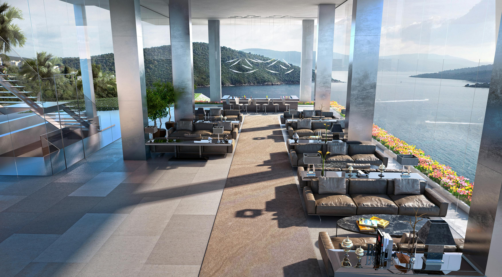

# 🛠️ Hướng Dẫn Tự Tay Làm Lại Dự Án Luna Nha Trang Retreat

> Hướng dẫn từng bước — bạn chỉ cần đọc, gõ lệnh, viết code theo.

---

## 📌 PHẦN 0 — Chuẩn Bị Môi Trường (Làm 1 Lần)

### 0.1 Cài Node.js

1. Vào **https://nodejs.org** → Tải bản **LTS** (Long Term Support)
2. Chạy file `.msi` cài đặt, bấm Next liên tục
3. Sau khi cài xong, mở **PowerShell** hoặc **Terminal** và kiểm tra:

```powershell
node --version
# Phải thấy: v20.x.x hoặc v22.x.x

npm --version
# Phải thấy: 10.x.x hoặc cao hơn
```

> Nếu không thấy → khởi động lại máy rồi thử lại.

### 0.2 Cài VS Code (Editor)

- Tải tại **https://code.visualstudio.com**
- Extensions nên cài:
  - `ES7+ React/Redux/React-Native snippets` — gõ shortcut tạo component nhanh
  - `Tailwind CSS IntelliSense` — gợi ý class Tailwind
  - `Prettier` — tự format code

---

## 📌 PHẦN 1 — Tạo Dự Án Mới

### 1.1 Mở Terminal và Tạo Project Vite

Mở **PowerShell** / **Command Prompt** trong thư mục bạn muốn đặt dự án.

```powershell
# Ví dụ: vào thư mục làm việc trước
cd "C:\HydroNion\Thiết kế Wed"

# Tạo project Vite + React mới trong thư mục tên "KhachSan"
npm create vite@latest KhachSan -- --template react

# Vào thư mục vừa tạo
cd KhachSan

# Cài tất cả dependencies mặc định
npm install
```

Lúc này bạn có cấu trúc thư mục cơ bản của Vite:

```
KhachSan/
  public/
  src/
    assets/
    App.jsx
    App.css
    main.jsx
    index.css
  index.html
  package.json
  vite.config.js
```

### 1.2 Chạy Thử Lần Đầu

```powershell
npm run dev
```

Mở trình duyệt tại `http://localhost:5173` — sẽ thấy trang demo mặc định của Vite.

---

## 📌 PHẦN 2 — Cài Thêm Thư Viện

### 2.1 Tailwind CSS v4 (cách mới nhất — dùng plugin Vite)

```powershell
npm install tailwindcss @tailwindcss/vite
```

> **Lưu ý quan trọng:** Tailwind v4 không dùng file `tailwind.config.js` nữa.  
> Tất cả cấu hình theme đặt trong `src/index.css` bằng cú pháp `@theme { }`.

### 2.2 Lucide React (Thư Viện Icon)

```powershell
npm install lucide-react
```

### 2.3 Kiểm Tra package.json

Sau khi cài, file `package.json` của bạn phải trông giống thế này:

```json
{
  "name": "KhachSan",
  "private": true,
  "version": "0.0.0",
  "type": "module",
  "scripts": {
    "dev": "vite",
    "build": "vite build",
    "lint": "eslint .",
    "preview": "vite preview"
  },
  "dependencies": {
    "lucide-react": "^1.16.0",
    "react": "^19.2.6",
    "react-dom": "^19.2.6"
  },
  "devDependencies": {
    "@tailwindcss/vite": "^4.3.0",
    "@vitejs/plugin-react": "^6.0.1",
    "tailwindcss": "^4.3.0",
    "vite": "^8.0.12"
  }
}
```

---

## 📌 PHẦN 3 — Cấu Hình Các File Nền Tảng

Đây là 4 file phải sửa/tạo trước khi viết bất kỳ component nào.

### 3.1 Cấu Hình `vite.config.js`

Mở file `vite.config.js` (ở thư mục gốc), **xóa toàn bộ** và thay bằng:

```js
// vite.config.js
import { defineConfig } from 'vite'
import react from '@vitejs/plugin-react'
import tailwindcss from '@tailwindcss/vite'

export default defineConfig({
  plugins: [
    react(),
    tailwindcss(),   // ← Thêm dòng này để kích hoạt Tailwind v4
  ],
})
```

> **Tại sao?** Tailwind v4 tích hợp trực tiếp vào Vite qua plugin, không cần file config riêng.

### 3.2 Cấu Hình `src/index.css`

Mở file `src/index.css`, **xóa toàn bộ** rồi thay bằng nội dung sau:

```css
/* src/index.css */

/* === Bước 1: Import Tailwind CSS === */
@import "tailwindcss";

/* === Bước 2: Khai báo theme tùy chỉnh (Tailwind v4 syntax) === */
@theme {
  /* Font */
  --font-serif: 'Cormorant Garamond', Georgia, serif;
  --font-sans: 'Inter', system-ui, sans-serif;

  /* Màu Ocean (Xanh Dương) */
  --color-ocean-50:  #f0f9ff;
  --color-ocean-100: #e0f2fe;
  --color-ocean-200: #bae6fd;
  --color-ocean-300: #7dd3fc;
  --color-ocean-400: #38bdf8;
  --color-ocean-500: #0ea5e9;
  --color-ocean-600: #0284c7;
  --color-ocean-700: #0369a1;
  --color-ocean-800: #075985;
  --color-ocean-900: #0c4a6e;

  /* Màu Sand (Be) */
  --color-sand-50:  #faf9f7;
  --color-sand-100: #f5f3ef;
  --color-sand-200: #ede9e1;
  --color-sand-300: #ddd6c8;
  --color-sand-400: #c8bca8;
  --color-sand-500: #b09f89;
  --color-sand-600: #9a8872;
  --color-sand-700: #7f6f5e;
  --color-sand-800: #675c4e;
  --color-sand-900: #554c42;

  /* Màu Vàng Gold */
  --color-luxury-gold:  #c9a84c;
  --color-luxury-light: #e8d5a3;
}

/* === Bước 3: Reset cơ bản === */
*, *::before, *::after {
  box-sizing: border-box;
}

html {
  scroll-behavior: smooth;
}

body {
  font-family: var(--font-sans);
  background-color: #fafaf9;
  color: #1a1a1a;
  -webkit-font-smoothing: antialiased;
}

/* Tiêu đề dùng font serif */
h1, h2, h3 {
  font-family: var(--font-serif);
}

/* === Bước 4: Scrollbar tùy chỉnh === */
::-webkit-scrollbar { width: 6px; }
::-webkit-scrollbar-track { background: #f1f1f1; }
::-webkit-scrollbar-thumb { background: #0369a1; border-radius: 3px; }
::-webkit-scrollbar-thumb:hover { background: #075985; }

/* === Bước 5: Các animation hay dùng === */
@keyframes fadeInUp {
  from { opacity: 0; transform: translateY(30px); }
  to   { opacity: 1; transform: translateY(0); }
}

@keyframes fadeIn {
  from { opacity: 0; }
  to   { opacity: 1; }
}

@keyframes float {
  0%, 100% { transform: translateY(0px); }
  50%       { transform: translateY(-10px); }
}

.animate-fade-in-up   { animation: fadeInUp 0.8s ease-out forwards; }
.animate-fade-in      { animation: fadeIn 1s ease-out forwards; }
.animate-float        { animation: float 6s ease-in-out infinite; }

/* Delay classes */
.delay-100 { animation-delay: 100ms; }
.delay-200 { animation-delay: 200ms; }
.delay-300 { animation-delay: 300ms; }
.delay-400 { animation-delay: 400ms; }
.delay-500 { animation-delay: 500ms; }

/* === Bước 6: Các utility class tái sử dụng === */

/* Glassmorphism — khung kính mờ */
.glass {
  background: rgba(255, 255, 255, 0.15);
  backdrop-filter: blur(12px);
  -webkit-backdrop-filter: blur(12px);
  border: 1px solid rgba(255, 255, 255, 0.2);
}

/* Đường kẻ vàng trang trí bên trái tiêu đề */
.section-line::before {
  content: '';
  display: block;
  width: 50px;
  height: 1px;
  background: #c9a84c;
  margin-bottom: 1rem;
}

/* Chữ gradient vàng */
.text-gold-gradient {
  background: linear-gradient(135deg, #c9a84c, #e8d5a3, #c9a84c);
  -webkit-background-clip: text;
  -webkit-text-fill-color: transparent;
  background-clip: text;
}

/* Hover scale nhẹ */
.hover-scale {
  transition: transform 0.4s cubic-bezier(0.25, 0.46, 0.45, 0.94);
}
.hover-scale:hover {
  transform: scale(1.03);
}
```

### 3.3 Cấu Hình `index.html`

Mở file `index.html` ở thư mục gốc, **xóa toàn bộ** và thay bằng:

```html
<!doctype html>
<html lang="vi">
  <head>
    <meta charset="UTF-8" />
    <link rel="icon" type="image/svg+xml" href="/favicon.svg" />
    <meta name="viewport" content="width=device-width, initial-scale=1.0" />

    <!-- SEO Meta Tags -->
    <meta name="description" content="Luna Nha Trang Retreat — Nghỉ dưỡng cao cấp trên vách đá nhìn ra vịnh biển Nha Trang." />
    <meta property="og:title" content="Luna Nha Trang Retreat | Luxury Hotel" />
    <meta property="og:type" content="website" />

    <!-- Google Fonts (Load 2 font: Cormorant Garamond + Inter) -->
    <link rel="preconnect" href="https://fonts.googleapis.com" />
    <link rel="preconnect" href="https://fonts.gstatic.com" crossorigin />
    <link href="https://fonts.googleapis.com/css2?family=Cormorant+Garamond:ital,wght@0,300;0,400;0,500;0,600;1,300;1,400&family=Inter:wght@300;400;500;600&display=swap" rel="stylesheet" />

    <title>Luna Nha Trang Retreat | Luxury Hotel</title>
  </head>
  <body>
    <div id="root"></div>
    <script type="module" src="/src/main.jsx"></script>
  </body>
</html>
```

> **Tại sao Load font trong HTML?** Font Google Fonts phải load từ CDN internet — phải đặt trong `<head>` của HTML, không đặt trong CSS `import`.

### 3.4 File `src/main.jsx`

File này Vite đã tạo sẵn, chỉ cần đảm bảo nội dung như sau (không cần thay đổi):

```jsx
// src/main.jsx
import { StrictMode } from 'react'
import { createRoot } from 'react-dom/client'
import './index.css'       // ← Phải import CSS ở đây
import App from './App.jsx'

createRoot(document.getElementById('root')).render(
  <StrictMode>
    <App />
  </StrictMode>,
)
```

---

## 📌 PHẦN 4 — Cấu Trúc Thư Mục Tài Nguyên (Ảnh & Video)

### Quy tắc vàng của Vite:

> ✅ Ảnh/Video đặt trong thư mục `public/`  
> ✅ Dùng trong code bằng đường dẫn bắt đầu `/` (bỏ chữ "public")  
> ❌ KHÔNG được viết `/public/...` trong src của thẻ `` hay `<video>`

```
public/
  images/
    Angelina_Suite.jpg      ← /images/Angelina_Suite.jpg
    Grand_De_Luxe.jpg       ← /images/Grand_De_Luxe.jpg
    Romantic_Hideaway.jpg   ← /images/Romantic_Hideaway.jpg
    La_Mer.jpg              ← /images/La_Mer.jpg
    HaiSan.jpg              ← /images/HaiSan.jpg
    Wine_Cellar.jpg         ← /images/Wine_Cellar.jpg
    TamNhinVinh.jpg         ← /images/TamNhinVinh.jpg
    HoangHon.jpg            ← /images/HoangHon.jpg
  videos/
    hero-sea.mp4            ← /videos/hero-sea.mp4
  favicon.svg
```

**Ví dụ dùng trong JSX:**

```jsx
{/* ✅ ĐÚNG */}

<video src="/videos/hero-sea.mp4" />

{/* ❌ SAI — sẽ lỗi trên Vercel */}


```

---

## 📌 PHẦN 5 — Tạo Cấu Trúc Thư Mục src/

Tạo thủ công các thư mục và file sau trong `src/`:

```
src/
  components/
    Header.jsx
    Hero.jsx
    BookingBar.jsx
    Concept.jsx
    Rooms.jsx
    RoomCard.jsx
    Dining.jsx
    Experiences.jsx
    Footer.jsx
    SearchResults.jsx
  context/
    BookingContext.jsx
  App.jsx
  main.jsx
  index.css
```

---

## 📌 PHẦN 6 — Skeleton Code Các File Chính

### 6.1 Context — `src/context/BookingContext.jsx`

File này quản lý state toàn cục (Global State) — view hiện tại là Home hay Search, thông tin tìm kiếm, danh sách đặt phòng.

```jsx
// src/context/BookingContext.jsx
import { createContext, useContext, useState } from 'react'

// Bước 1: Tạo Context object
const BookingContext = createContext(null)

// Bước 2: Provider — bao bọc toàn bộ app, cung cấp state cho các component con
export function BookingProvider({ children }) {
  const [view, setView] = useState('home')      // 'home' | 'search'
  const [searchParams, setSearchParams] = useState({
    checkIn: '',
    checkOut: '',
    guests: 2,
    roomType: 'all',
  })
  const [bookings, setBookings] = useState([])   // Mảng chứa các đặt phòng

  // Hàm thêm đặt phòng mới
  const addBooking = (room) => {
    const newBooking = {
      id: Date.now(),                            // ID tự sinh theo timestamp
      room,
      ...searchParams,
      status: 'confirmed',
    }
    setBookings(prev => [newBooking, ...prev])
  }

  // Hàm huỷ đặt phòng
  const cancelBooking = (id) => {
    setBookings(prev =>
      prev.map(b => b.id === id ? { ...b, status: 'cancelled' } : b)
    )
  }

  return (
    <BookingContext.Provider value={{
      view, setView,
      searchParams, setSearchParams,
      bookings,
      addBooking,
      cancelBooking,
    }}>
      {children}
    </BookingContext.Provider>
  )
}

// Bước 3: Custom hook để dùng context dễ dàng
export function useBooking() {
  const ctx = useContext(BookingContext)
  if (!ctx) throw new Error('useBooking phải dùng bên trong BookingProvider')
  return ctx
}
```

### 6.2 App Root — `src/App.jsx`

```jsx
// src/App.jsx
import { useEffect, useState } from 'react'
import { BookingProvider, useBooking } from './context/BookingContext'
import Header from './components/Header'
import Hero from './components/Hero'
import BookingBar from './components/BookingBar'
import Concept from './components/Concept'
import Rooms from './components/Rooms'
import Dining from './components/Dining'
import Experiences from './components/Experiences'
import Footer from './components/Footer'
import SearchResults from './components/SearchResults'

// --- Nút Back-to-Top (đơn sắc) ---
function BackToTop() {
  const [visible, setVisible] = useState(false)

  useEffect(() => {
    const handleScroll = () => setVisible(window.scrollY > 600)
    window.addEventListener('scroll', handleScroll)
    return () => window.removeEventListener('scroll', handleScroll)
  }, [])

  return (
    <button
      onClick={() => window.scrollTo({ top: 0, behavior: 'smooth' })}
      aria-label="Về đầu trang"
      className={`fixed bottom-8 right-8 z-40 w-11 h-11 bg-gray-900 text-white
        rounded-full flex items-center justify-center shadow-lg
        hover:bg-gray-700 transition-all duration-300
        ${visible ? 'opacity-100 translate-y-0' : 'opacity-0 translate-y-4 pointer-events-none'}`}
    >
      {/* Icon SVG mũi tên lên */}
      <svg width="16" height="16" viewBox="0 0 24 24" fill="none"
        stroke="currentColor" strokeWidth="2" strokeLinecap="round" strokeLinejoin="round">
        <path d="M18 15l-6-6-6 6" />
      </svg>
    </button>
  )
}

// --- Nút Gọi Điện Nổi (đơn sắc) ---
function FloatingContact() {
  return (
    <a
      href="tel:+84368789135"
      aria-label="Gọi điện hotline"
      className="fixed bottom-24 right-8 z-40 w-11 h-11 bg-gray-900 text-white
        rounded-full flex items-center justify-center shadow-lg
        hover:bg-gray-700 transition-all duration-300"
    >
      <svg width="17" height="17" viewBox="0 0 24 24" fill="none"
        stroke="currentColor" strokeWidth="1.8" strokeLinecap="round" strokeLinejoin="round">
        <path d="M22 16.92v3a2 2 0 0 1-2.18 2 19.79 19.79 0 0 1-8.63-3.07A19.5 19.5 0 0 1 4.69 12a19.79 19.79 0 0 1-3.07-8.67A2 2 0 0 1 3.61 1h3a2 2 0 0 1 2 1.72 12.84 12.84 0 0 0 .7 2.81 2 2 0 0 1-.45 2.11L7.91 8.6a16 16 0 0 0 6 6l.96-.96a2 2 0 0 1 2.11-.45 12.84 12.84 0 0 0 2.81.7A2 2 0 0 1 22 16.92z" />
      </svg>
    </a>
  )
}

// --- View switcher: Home hoặc SearchResults ---
function AppContent() {
  const { view } = useBooking()

  if (view === 'search') {
    return (
      <div className="min-h-screen">
        <SearchResults />
        <BackToTop />
        <FloatingContact />
      </div>
    )
  }

  return (
    <div className="min-h-screen">
      <Header />
      <main>
        <Hero />
        <BookingBar />
        <Concept />
        <Rooms />
        <Dining />
        <Experiences />
      </main>
      <Footer />
      <BackToTop />
      <FloatingContact />
    </div>
  )
}

// --- Root export ---
export default function App() {
  return (
    <BookingProvider>
      <AppContent />
    </BookingProvider>
  )
}
```

### 6.3 Hero Section — `src/components/Hero.jsx`

```jsx
// src/components/Hero.jsx
import { useEffect, useRef, useState } from 'react'
import { ChevronDown } from 'lucide-react'

// Phần nền video
const HeroBackground = () => (
  <div className="absolute inset-0 overflow-hidden -z-10">
    {/* Video nền — đặt file trong public/videos/hero-sea.mp4 */}
    <video
      autoPlay
      loop
      muted
      playsInline
      className="w-full h-screen object-cover absolute top-0 left-0 -z-10"
    >
      <source src="/videos/hero-sea.mp4" type="video/mp4" />
      Trình duyệt của bạn không hỗ trợ thẻ video.
    </video>

    {/* Overlay tối để chữ nổi bật */}
    <div className="absolute inset-0 bg-slate-950/30" />
  </div>
)

export default function Hero() {
  const scrollToBooking = () => {
    document.getElementById('booking-section')?.scrollIntoView({ behavior: 'smooth' })
  }

  return (
    <section className="relative h-screen flex flex-col items-center justify-center overflow-hidden">
      <HeroBackground />

      {/* Nội dung trung tâm */}
      <div className="relative z-10 text-center text-white px-4">
        <p className="text-sm tracking-[0.3em] uppercase text-white/70 mb-4 animate-fade-in">
          Nha Trang · Việt Nam
        </p>
        <h1 className="font-serif text-5xl md:text-7xl lg:text-8xl font-light mb-6 animate-fade-in-up">
          Luna Retreat
        </h1>
        <p className="text-lg md:text-xl text-white/80 font-light max-w-lg mx-auto mb-10 animate-fade-in-up delay-200">
          Nơi vách đá gặp biển khơi — trải nghiệm nghỉ dưỡng vượt thời gian
        </p>
        <button
          onClick={scrollToBooking}
          className="border border-white/50 text-white px-10 py-3 text-sm tracking-widest uppercase
            hover:bg-white hover:text-gray-900 transition-all duration-300 animate-fade-in-up delay-300"
        >
          Đặt Phòng Ngay
        </button>
      </div>

      {/* Mũi tên cuộn xuống */}
      <button
        onClick={scrollToBooking}
        className="absolute bottom-8 left-1/2 -translate-x-1/2 text-white/60 hover:text-white
          transition-colors animate-float"
      >
        <ChevronDown size={32} strokeWidth={1} />
      </button>
    </section>
  )
}
```

### 6.4 Card Phòng — `src/components/RoomCard.jsx`

```jsx
// src/components/RoomCard.jsx
import { useState } from 'react'

// === DỮ LIỆU PHÒNG (Mock Data) ===
// Sửa price, image, name tại đây để thay đổi hiển thị
const rooms = [
  {
    id: 1,
    name: 'Angelina Suite',
    category: 'Suite',
    price: 4800000,                          // VNĐ/đêm
    image: '/images/Angelina_Suite.jpg',     // Đường dẫn ảnh trong public/images/
    size: '85m²',
    view: 'Toàn cảnh vịnh biển',
    beds: '1 giường King',
    guests: 2,
    description: 'Suite sang trọng với ban công riêng nhìn ra vịnh Nha Trang.',
    amenities: ['WiFi tốc độ cao', 'Bồn tắm freestanding', 'Minibar', 'Máy pha cà phê', 'Butler riêng'],
  },
  {
    id: 2,
    name: 'Grand De Luxe',
    category: 'Deluxe',
    price: 3200000,
    image: '/images/Grand_De_Luxe.jpg',
    size: '55m²',
    view: 'Hướng biển',
    beds: '1 giường King hoặc 2 giường Twin',
    guests: 2,
    description: 'Phòng Deluxe rộng rãi với thiết kế tối giản, tầm nhìn hướng biển.',
    amenities: ['WiFi tốc độ cao', 'Vòi sen rain shower', 'Minibar', 'Bàn làm việc'],
  },
  {
    id: 3,
    name: 'Romantic Hideaway',
    category: 'Suite',
    price: 6500000,
    image: '/images/Romantic_Hideaway.jpg',
    size: '110m²',
    view: 'Vịnh biển & bể bơi riêng',
    beds: '1 giường King',
    guests: 2,
    description: 'Suite riêng tư tuyệt đối với bể bơi infinity nhìn thẳng ra biển.',
    amenities: ['Bể bơi riêng', 'Butler 24/7', 'Champagne chào mừng', 'Bồn tắm ngoài trời', 'WiFi'],
  },
]

// Helper format tiền Việt
const formatPrice = (price) =>
  new Intl.NumberFormat('vi-VN').format(price) + ' ₫'

// === COMPONENT CARD ===
export default function RoomCard({ room }) {
  const [showModal, setShowModal] = useState(false)

  return (
    <>
      {/* Card */}
      <div
        className="group cursor-pointer"
        onClick={() => setShowModal(true)}
      >
        {/* Ảnh phòng */}
        <div className="overflow-hidden mb-4 aspect-[4/3]">
          
        </div>

        {/* Thông tin tóm tắt */}
        <div>
          <span className="text-xs tracking-widest text-gray-400 uppercase">{room.category}</span>
          <h3 className="font-serif text-2xl mt-1 mb-2">{room.name}</h3>
          <div className="flex justify-between items-center">
            <span className="text-sm text-gray-500">{room.size} · {room.view}</span>
            <span className="font-semibold text-gray-900">
              {formatPrice(room.price)}<span className="text-xs font-normal text-gray-400">/đêm</span>
            </span>
          </div>
        </div>
      </div>

      {/* Modal Chi Tiết */}
      {showModal && (
        <div
          className="fixed inset-0 z-50 flex items-center justify-center bg-black/60 p-4"
          onClick={() => setShowModal(false)}
        >
          <div
            className="bg-white max-w-2xl w-full rounded-sm overflow-hidden shadow-2xl"
            onClick={e => e.stopPropagation()}   // Chặn click lan ra overlay
          >
            
            <div className="p-8">
              <div className="flex justify-between items-start mb-4">
                <div>
                  <p className="text-xs tracking-widest text-gray-400 uppercase mb-1">{room.category}</p>
                  <h2 className="font-serif text-3xl">{room.name}</h2>
                </div>
                <div className="text-right">
                  <p className="text-2xl font-semibold">{formatPrice(room.price)}</p>
                  <p className="text-sm text-gray-400">mỗi đêm</p>
                </div>
              </div>
              <p className="text-gray-600 mb-6">{room.description}</p>
              <div className="grid grid-cols-2 gap-3 mb-6 text-sm">
                <span>📐 {room.size}</span>
                <span>👁 {room.view}</span>
                <span>🛏 {room.beds}</span>
                <span>👤 Tối đa {room.guests} khách</span>
              </div>
              <ul className="space-y-1 mb-6">
                {room.amenities.map(a => (
                  <li key={a} className="text-sm text-gray-600 flex gap-2">
                    <span className="text-green-500">✓</span> {a}
                  </li>
                ))}
              </ul>
              <div className="flex gap-3">
                <button
                  onClick={() => setShowModal(false)}
                  className="flex-1 border border-gray-300 py-3 text-sm tracking-widest uppercase
                    hover:bg-gray-50 transition-colors"
                >
                  Đóng
                </button>
              </div>
            </div>
          </div>
        </div>
      )}
    </>
  )
}

// Export rooms để dùng ở SearchResults.jsx
export { rooms }
```

### 6.5 Rooms Section — `src/components/Rooms.jsx`

```jsx
// src/components/Rooms.jsx
import RoomCard, { rooms } from './RoomCard'

export default function Rooms() {
  return (
    <section id="rooms" className="py-24 px-4 bg-white">
      <div className="max-w-6xl mx-auto">

        {/* Tiêu đề section */}
        <div className="text-center mb-16">
          <p className="section-line text-xs tracking-[0.3em] uppercase text-gray-400 mb-3">
            Phòng & Suite
          </p>
          <h2 className="font-serif text-4xl md:text-5xl font-light">
            Không Gian Của Bạn
          </h2>
          <p className="text-gray-500 mt-4 max-w-md mx-auto">
            Mỗi phòng là một tác phẩm kiến trúc, nơi sự sang trọng hòa quyện với thiên nhiên.
          </p>
        </div>

        {/* Grid 3 card phòng */}
        <div className="grid grid-cols-1 md:grid-cols-2 lg:grid-cols-3 gap-10">
          {rooms.map(room => (
            <RoomCard key={room.id} room={room} />
          ))}
        </div>

        {/* CTA cuối section */}
        <div className="text-center mt-16">
          <p className="text-gray-500 mb-4">Cần tư vấn thêm về phòng phù hợp?</p>
          <a
            href="tel:+84368789135"
            className="inline-block border border-gray-900 px-10 py-3 text-sm tracking-widest uppercase
              hover:bg-gray-900 hover:text-white transition-all duration-300"
          >
            Hotline: +84 368 789 135
          </a>
        </div>
      </div>
    </section>
  )
}
```

---

## 📌 PHẦN 7 — Cách Dùng Tailwind CSS Đúng Cách

### Cú Pháp Class Cơ Bản

```jsx
// Layout
<div className="flex items-center justify-between gap-4">
<div className="grid grid-cols-3 gap-8">
<div className="max-w-6xl mx-auto px-4">

// Spacing (padding/margin)
<div className="p-4">       {/* padding 4 = 1rem */}
<div className="px-8 py-4"> {/* padding ngang 8, dọc 4 */}
<div className="mb-6">      {/* margin-bottom 6 = 1.5rem */}

// Typography
<h1 className="font-serif text-5xl font-light">   {/* font serif, cỡ 5xl, nhẹ */}
<p className="text-sm text-gray-500 tracking-widest">

// Màu background & text (dùng màu đã định nghĩa trong @theme)
<div className="bg-ocean-800 text-white">
<div className="bg-sand-50">
<span className="text-luxury-gold">

// Hover & transition
<button className="bg-gray-900 hover:bg-gray-700 transition-colors duration-300">

// Responsive (mobile-first: mặc định là mobile, md: = tablet, lg: = desktop)
<div className="text-2xl md:text-4xl lg:text-6xl">
<div className="grid grid-cols-1 md:grid-cols-2 lg:grid-cols-3">

// Position & z-index
<div className="fixed bottom-8 right-8 z-40">
<div className="relative overflow-hidden">
<div className="absolute inset-0">

// Dùng class custom đã tạo trong CSS
<div className="glass">           {/* glassmorphism */}
<div className="section-line">   {/* đường kẻ vàng */}
<div className="hover-scale">    {/* scale khi hover */}
<p className="text-gold-gradient">{/* chữ gradient vàng */}
```

---

## 📌 PHẦN 8 — Cách Dùng Lucide React (Icon)

```jsx
// Cách 1: Import từng icon cần dùng
import { ChevronDown, Phone, Mail, MapPin, Star, Wifi, Coffee } from 'lucide-react'

// Cách 2: Dùng trong JSX với size và strokeWidth
<ChevronDown size={32} strokeWidth={1} />        // Icon to, nét mảnh
<Phone size={20} strokeWidth={1.5} />            // Icon trung bình
<Mail size={16} strokeWidth={2} />               // Icon nhỏ, nét bình thường

// Thêm class Tailwind
<Star size={20} className="text-yellow-500" />
<Wifi size={16} className="text-gray-400" />

// Icon trong nút
<button className="flex items-center gap-2">
  <Phone size={16} />
  <span>Gọi điện</span>
</button>
```

**Tìm icon:** Vào **https://lucide.dev** → Tìm kiếm tên tiếng Anh → Copy tên import.

---

## 📌 PHẦN 9 — Pattern Hay Dùng Trong Dự Án

### Pattern 1: Scroll vào section theo ID

```jsx
// Trong button onClick:
const scrollToSection = (id) => {
  document.getElementById(id)?.scrollIntoView({ behavior: 'smooth' })
}

// Section phải có id:
<section id="booking-section" className="py-16">
```

### Pattern 2: Fade-in khi scroll đến (Intersection Observer)

```jsx
import { useEffect, useRef, useState } from 'react'

function AnimatedSection({ children }) {
  const ref = useRef(null)
  const [visible, setVisible] = useState(false)

  useEffect(() => {
    const observer = new IntersectionObserver(
      ([entry]) => { if (entry.isIntersecting) setVisible(true) },
      { threshold: 0.1 }
    )
    if (ref.current) observer.observe(ref.current)
    return () => observer.disconnect()
  }, [])

  return (
    <div
      ref={ref}
      className={`transition-all duration-700 ${
        visible ? 'opacity-100 translate-y-0' : 'opacity-0 translate-y-8'
      }`}
    >
      {children}
    </div>
  )
}
```

### Pattern 3: Format tiền Việt

```jsx
const formatPrice = (price) =>
  new Intl.NumberFormat('vi-VN').format(price) + ' ₫'

// Dùng:
formatPrice(4800000)  // → "4.800.000 ₫"
```

### Pattern 4: Modal Overlay

```jsx
{isOpen && (
  <div
    className="fixed inset-0 z-50 flex items-center justify-center bg-black/60"
    onClick={() => setIsOpen(false)}           // Click ngoài để đóng
  >
    <div
      className="bg-white p-8 max-w-lg w-full mx-4"
      onClick={e => e.stopPropagation()}        // Chặn sự kiện lan ra
    >
      Nội dung modal...
    </div>
  </div>
)}
```

### Pattern 5: Dark/light overlay cho ảnh nền

```jsx
<div className="relative">
  
  {/* Overlay gradient từ dưới lên */}
  <div className="absolute inset-0 bg-gradient-to-t from-black/70 via-black/20 to-transparent" />
  {/* Nội dung chữ chồng lên */}
  <div className="absolute bottom-6 left-6 text-white">
    <h3 className="font-serif text-2xl">Tiêu đề</h3>
  </div>
</div>
```

---

## 📌 PHẦN 10 — Lỗi Hay Gặp & Cách Sửa

| Lỗi | Nguyên Nhân | Cách Sửa |
|-----|-------------|----------|
| Tailwind class không hoạt động | Chưa import `@import "tailwindcss"` trong CSS | Thêm dòng đó vào đầu `index.css` |
| Tailwind class không hoạt động | Chưa thêm `tailwindcss()` trong `vite.config.js` | Thêm vào mảng `plugins[]` |
| Ảnh không hiện (local) | Đường dẫn sai, có chữ `/public/` | Đổi thành `/images/...` |
| Ảnh không hiện (Vercel) | Ảnh chưa được commit vào Git | Commit ảnh, hoặc dùng CDN |
| Tên ảnh không khớp | Hoa/thường sai: `angelina_suite.jpg` vs `Angelina_Suite.jpg` | Viết đúng hoa/thường theo file thực tế |
| Video không phát trên mobile | Thiếu thuộc tính `playsInline` | Thêm `playsInline` vào thẻ `<video>` |
| HMR lỗi "export is incompatible" | Export constant ngoài component trong file JSX | Tách data/constant sang file riêng hoặc đặt ngoài component |
| "useBooking must be inside BookingProvider" | Dùng hook trước khi bọc Provider | Đảm bảo `<BookingProvider>` bọc ngoài cùng trong `App.jsx` |
| Font không load | Link Google Fonts chưa trong `index.html` | Thêm `<link>` font vào phần `<head>` của `index.html` |

---

## 📌 PHẦN 11 — Quy Trình Làm Việc Hàng Ngày

```
1. Mở terminal trong thư mục dự án
2. npm run dev        → Bật dev server
3. Mở VS Code
4. Mở http://localhost:5173 trên trình duyệt
5. Sửa code → Trình duyệt tự reload (HMR)
6. git add . → git commit -m "mô tả" → git push
7. Vercel tự deploy trong ~60 giây
```

---

## 📌 PHẦN 12 — Thứ Tự Tạo Component (Nên Theo)

Làm theo thứ tự này để tránh lỗi import chưa tồn tại:

```
1. BookingContext.jsx   ← State toàn cục
2. index.css           ← Style nền tảng
3. index.html          ← Font + SEO meta
4. RoomCard.jsx        ← Có data rooms[]
5. Hero.jsx            ← Section đơn giản nhất
6. Header.jsx          ← Navbar
7. BookingBar.jsx      ← Dùng useBooking()
8. Rooms.jsx           ← Dùng RoomCard
9. Dining.jsx          ← Section độc lập
10. Experiences.jsx    ← Section độc lập
11. Concept.jsx        ← Section độc lập
12. Footer.jsx         ← Cuối cùng
13. SearchResults.jsx  ← Dùng rooms[] và useBooking()
14. App.jsx            ← Lắp ghép tất cả lại
```

---

*Chúc bạn tự làm lại thành công! 🌊*
