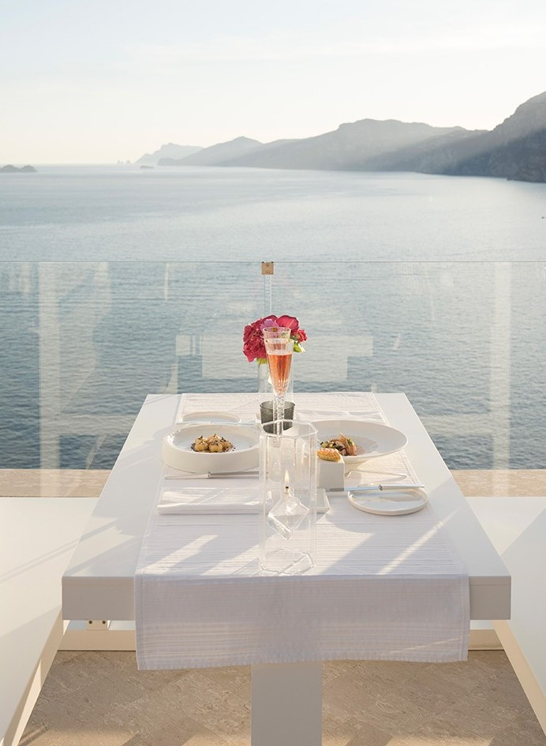

# 🛠️ Hướng Dẫn Tự Tay Làm Lại Dự Án Luna Nha Trang Retreat

> Hướng dẫn từng bước — bạn chỉ cần đọc, gõ lệnh, viết code theo.

---

## 📌 PHẦN 0 — Chuẩn Bị Môi Trường (Làm 1 Lần)

### 0.1 Cài Node.js

1. Vào **https://nodejs.org** → Tải bản **LTS** (Long Term Support)
2. Chạy file `.msi` cài đặt, bấm Next liên tục
3. Sau khi cài xong, mở **PowerShell** hoặc **Terminal** và kiểm tra:

```powershell
node --version
# Phải thấy: v20.x.x hoặc v22.x.x

npm --version
# Phải thấy: 10.x.x hoặc cao hơn
```

> Nếu không thấy → khởi động lại máy rồi thử lại.

### 0.2 Cài VS Code (Editor)

- Tải tại **https://code.visualstudio.com**
- Extensions nên cài:
  - `ES7+ React/Redux/React-Native snippets` — gõ shortcut tạo component nhanh
  - `Tailwind CSS IntelliSense` — gợi ý class Tailwind
  - `Prettier` — tự format code

---

## 📌 PHẦN 1 — Tạo Dự Án Mới

### 1.1 Mở Terminal và Tạo Project Vite

Mở **PowerShell** / **Command Prompt** trong thư mục bạn muốn đặt dự án.

```powershell
# Ví dụ: vào thư mục làm việc trước
cd "C:\HydroNion\Thiết kế Wed"

# Tạo project Vite + React mới trong thư mục tên "KhachSan"
npm create vite@latest KhachSan -- --template react

# Vào thư mục vừa tạo
cd KhachSan

# Cài tất cả dependencies mặc định
npm install
```

Lúc này bạn có cấu trúc thư mục cơ bản của Vite:

```
KhachSan/
  public/
  src/
    assets/
    App.jsx
    App.css
    main.jsx
    index.css
  index.html
  package.json
  vite.config.js
```

### 1.2 Chạy Thử Lần Đầu

```powershell
npm run dev
```

Mở trình duyệt tại `http://localhost:5173` — sẽ thấy trang demo mặc định của Vite.

---

## 📌 PHẦN 2 — Cài Thêm Thư Viện

### 2.1 Tailwind CSS v4 (cách mới nhất — dùng plugin Vite)

```powershell
npm install tailwindcss @tailwindcss/vite
```

> **Lưu ý quan trọng:** Tailwind v4 không dùng file `tailwind.config.js` nữa.  
> Tất cả cấu hình theme đặt trong `src/index.css` bằng cú pháp `@theme { }`.

### 2.2 Lucide React (Thư Viện Icon)

```powershell
npm install lucide-react
```

### 2.3 Kiểm Tra package.json

Sau khi cài, file `package.json` của bạn phải trông giống thế này:

```json
{
  "name": "KhachSan",
  "private": true,
  "version": "0.0.0",
  "type": "module",
  "scripts": {
    "dev": "vite",
    "build": "vite build",
    "lint": "eslint .",
    "preview": "vite preview"
  },
  "dependencies": {
    "lucide-react": "^1.16.0",
    "react": "^19.2.6",
    "react-dom": "^19.2.6"
  },
  "devDependencies": {
    "@tailwindcss/vite": "^4.3.0",
    "@vitejs/plugin-react": "^6.0.1",
    "tailwindcss": "^4.3.0",
    "vite": "^8.0.12"
  }
}
```

---

## 📌 PHẦN 3 — Cấu Hình Các File Nền Tảng

Đây là 4 file phải sửa/tạo trước khi viết bất kỳ component nào.

### 3.1 Cấu Hình `vite.config.js`

Mở file `vite.config.js` (ở thư mục gốc), **xóa toàn bộ** và thay bằng:

```js
// vite.config.js
import { defineConfig } from 'vite'
import react from '@vitejs/plugin-react'
import tailwindcss from '@tailwindcss/vite'

export default defineConfig({
  plugins: [
    react(),
    tailwindcss(),   // ← Thêm dòng này để kích hoạt Tailwind v4
  ],
  // Bỏ qua file tạm để tránh lỗi EBUSY trên Windows
  server: {
    watch: {
      ignored: ['**/*.tmp', '**/*.log', '**/node_modules/**'],
    },
  },
})
```

> **Tại sao?** Tailwind v4 tích hợp trực tiếp vào Vite qua plugin, không cần file config riêng. Cấu hình `watch.ignored` tránh crash server trên Windows.

### 3.2 Cấu Hình `src/index.css`

Mở file `src/index.css`, **xóa toàn bộ** rồi thay bằng nội dung sau:

```css
/* src/index.css */

/* === Bước 1: Import Tailwind CSS === */
@import "tailwindcss";

/* === Bước 2: Khai báo theme tùy chỉnh (Tailwind v4 syntax) === */
@theme {
  /* Font */
  --font-serif: 'Cormorant Garamond', Georgia, serif;
  --font-sans: 'Inter', system-ui, sans-serif;

  /* Màu Ocean (Xanh Dương) */
  --color-ocean-50:  #f0f9ff;
  --color-ocean-100: #e0f2fe;
  --color-ocean-200: #bae6fd;
  --color-ocean-300: #7dd3fc;
  --color-ocean-400: #38bdf8;
  --color-ocean-500: #0ea5e9;
  --color-ocean-600: #0284c7;
  --color-ocean-700: #0369a1;
  --color-ocean-800: #075985;
  --color-ocean-900: #0c4a6e;

  /* Màu Sand (Be) */
  --color-sand-50:  #faf9f7;
  --color-sand-100: #f5f3ef;
  --color-sand-200: #ede9e1;
  --color-sand-300: #ddd6c8;
  --color-sand-400: #c8bca8;
  --color-sand-500: #b09f89;
  --color-sand-600: #9a8872;
  --color-sand-700: #7f6f5e;
  --color-sand-800: #675c4e;
  --color-sand-900: #554c42;

  /* Màu Vàng Gold */
  --color-luxury-gold:  #c9a84c;
  --color-luxury-light: #e8d5a3;
}

/* === Bước 3: Reset cơ bản === */
*, *::before, *::after {
  box-sizing: border-box;
}

html {
  scroll-behavior: smooth;
}

body {
  font-family: var(--font-sans);
  background-color: #fafaf9;
  color: #1a1a1a;
  -webkit-font-smoothing: antialiased;
}

/* Tiêu đề dùng font serif */
h1, h2, h3 {
  font-family: var(--font-serif);
}

/* === Bước 4: Scrollbar tùy chỉnh === */
::-webkit-scrollbar { width: 6px; }
::-webkit-scrollbar-track { background: #f1f1f1; }
::-webkit-scrollbar-thumb { background: #0369a1; border-radius: 3px; }
::-webkit-scrollbar-thumb:hover { background: #075985; }

/* === Bước 5: Các animation hay dùng === */
@keyframes fadeInUp {
  from { opacity: 0; transform: translateY(30px); }
  to   { opacity: 1; transform: translateY(0); }
}

@keyframes fadeIn {
  from { opacity: 0; }
  to   { opacity: 1; }
}

@keyframes float {
  0%, 100% { transform: translateY(0px); }
  50%       { transform: translateY(-10px); }
}

.animate-fade-in-up   { animation: fadeInUp 0.8s ease-out forwards; }
.animate-fade-in      { animation: fadeIn 1s ease-out forwards; }
.animate-float        { animation: float 6s ease-in-out infinite; }

/* Delay classes */
.delay-100 { animation-delay: 100ms; }
.delay-200 { animation-delay: 200ms; }
.delay-300 { animation-delay: 300ms; }
.delay-400 { animation-delay: 400ms; }
.delay-500 { animation-delay: 500ms; }

/* === Bước 6: Các utility class tái sử dụng === */

/* Glassmorphism — khung kính mờ */
.glass {
  background: rgba(255, 255, 255, 0.15);
  backdrop-filter: blur(12px);
  -webkit-backdrop-filter: blur(12px);
  border: 1px solid rgba(255, 255, 255, 0.2);
}

/* Đường kẻ vàng trang trí bên trái tiêu đề */
.section-line::before {
  content: '';
  display: block;
  width: 50px;
  height: 1px;
  background: #c9a84c;
  margin-bottom: 1rem;
}

/* Chữ gradient vàng */
.text-gold-gradient {
  background: linear-gradient(135deg, #c9a84c, #e8d5a3, #c9a84c);
  -webkit-background-clip: text;
  -webkit-text-fill-color: transparent;
  background-clip: text;
}

/* Hover scale nhẹ */
.hover-scale {
  transition: transform 0.4s cubic-bezier(0.25, 0.46, 0.45, 0.94);
}
.hover-scale:hover {
  transform: scale(1.03);
}
```

### 3.3 Cấu Hình `index.html`

Mở file `index.html` ở thư mục gốc, **xóa toàn bộ** và thay bằng:

```html
<!doctype html>
<html lang="vi">
  <head>
    <meta charset="UTF-8" />
    <link rel="icon" type="image/svg+xml" href="/favicon.svg" />
    <meta name="viewport" content="width=device-width, initial-scale=1.0" />

    <!-- SEO Meta Tags -->
    <meta name="description" content="Luna Nha Trang Retreat — Nghỉ dưỡng cao cấp trên vách đá nhìn ra vịnh biển Nha Trang." />
    <meta property="og:title" content="Luna Nha Trang Retreat | Luxury Hotel" />
    <meta property="og:type" content="website" />

    <!-- Google Fonts (Load 2 font: Cormorant Garamond + Inter) -->
    <link rel="preconnect" href="https://fonts.googleapis.com" />
    <link rel="preconnect" href="https://fonts.gstatic.com" crossorigin />
    <link href="https://fonts.googleapis.com/css2?family=Cormorant+Garamond:ital,wght@0,300;0,400;0,500;0,600;1,300;1,400&family=Inter:wght@300;400;500;600&display=swap" rel="stylesheet" />

    <title>Luna Nha Trang Retreat | Luxury Hotel</title>
  </head>
  <body>
    <div id="root"></div>
    <script type="module" src="/src/main.jsx"></script>
  </body>
</html>
```

> **Tại sao Load font trong HTML?** Font Google Fonts phải load từ CDN internet — phải đặt trong `<head>` của HTML, không đặt trong CSS `import`.

### 3.4 File `src/main.jsx`

File này Vite đã tạo sẵn, chỉ cần đảm bảo nội dung như sau (không cần thay đổi):

```jsx
// src/main.jsx
import { StrictMode } from 'react'
import { createRoot } from 'react-dom/client'
import './index.css'       // ← Phải import CSS ở đây
import App from './App.jsx'

createRoot(document.getElementById('root')).render(
  <StrictMode>
    <App />
  </StrictMode>,
)
```

---

## 📌 PHẦN 4 — Cấu Trúc Thư Mục Tài Nguyên (Ảnh & Video)

### Quy tắc vàng của Vite:

> ✅ Ảnh/Video đặt trong thư mục `public/`  
> ✅ Dùng trong code bằng đường dẫn bắt đầu `/` (bỏ chữ "public")  
> ❌ KHÔNG được viết `/public/...` trong src của thẻ `` hay `<video>`

```
public/
  images/
    la-mer.jpg           ← /images/la-mer.jpg
    angelina-suite.jpg   ← /images/angelina-suite.jpg
    grand-de-luxe.jpg    ← /images/grand-de-luxe.jpg
    romantic.jpg         ← /images/romantic.jpg
    yoga.jpg             ← /images/yoga.jpg        (Experiences)
    lanbien.jpg          ← /images/lanbien.jpg     (Experiences)
    tranhthuymac.jpg     ← /images/tranhthuymac.jpg
    duthuyen.jpg         ← /images/duthuyen.jpg
    spakhoang.jpg        ← /images/spakhoang.jpg
    lophocnauan.jpg      ← /images/lophocnauan.jpg
    footer.jpg           ← /images/footer.jpg
  videos/
    hero-sea.mp4         ← /videos/hero-sea.mp4
  favicon.svg
```

**Ví dụ dùng trong JSX:**

```jsx
{/* ✅ ĐÚNG */}

<video src="/videos/hero-sea.mp4" />

{/* ❌ SAI — sẽ lỗi trên Vercel */}


```

---

## 📌 PHẦN 5 — Tạo Cấu Trúc Thư Mục src/

Tạo thủ công các thư mục và file sau trong `src/`:

```
src/
  components/
    Header.jsx
    Hero.jsx
    BookingBar.jsx
    Concept.jsx
    Rooms.jsx
    RoomCard.jsx
    Dining.jsx
    Experiences.jsx
    Footer.jsx
    SearchResults.jsx
  context/
    BookingContext.jsx
  App.jsx
  main.jsx
  index.css
```

---

## 📌 PHẦN 6 — Skeleton Code Các File Chính

### 6.1 Context — `src/context/BookingContext.jsx`

File này quản lý state toàn cục (Global State) — view hiện tại, thông tin tìm kiếm, danh sách đặt phòng, và hàm kiểm tra xung đột lịch.

```jsx
// src/context/BookingContext.jsx
import { createContext, useContext, useState, useCallback } from 'react'

const BookingContext = createContext(null)

// Load & save bookings từ localStorage (dữ liệu bền vững giữa các lần reload)
const loadBookings = () => {
  try {
    const saved = localStorage.getItem('luna_bookings')
    return saved ? JSON.parse(saved) : []
  } catch { return [] }
}
const saveBookings = (bookings) => {
  try { localStorage.setItem('luna_bookings', JSON.stringify(bookings)) } catch {}
}

export function BookingProvider({ children }) {
  const [view, setView] = useState('home')      // 'home' | 'search'
  const [searchParams, setSearchParams] = useState(null)
  const [bookings, setBookings] = useState(loadBookings)

  const navigateToSearch = useCallback((params) => {
    setSearchParams(params)
    setView('search')
    window.scrollTo({ top: 0, behavior: 'smooth' })
  }, [])

  const navigateHome = useCallback(() => {
    setView('home')
    window.scrollTo({ top: 0, behavior: 'smooth' })
  }, [])

  // Thêm đặt phòng mới — trả về object booking (có .id)
  const addBooking = useCallback((booking) => {
    const newBooking = {
      ...booking,
      id: `LNA-${Date.now()}`,   // Mã đặt phòng tự sinh: LNA-XXXXXXXXX
      status: 'active',
      bookedAt: new Date().toISOString(),
    }
    setBookings((prev) => {
      const updated = [newBooking, ...prev]
      saveBookings(updated)
      return updated
    })
    return newBooking
  }, [])

  // Kiểm tra xung đột lịch: cùng phòng + status active + ngày chồng nhau
  // Điều kiện: newIn < existingOut AND newOut > existingIn
  const checkConflict = useCallback((roomId, checkIn, checkOut, bookings) => {
    const newIn  = new Date(checkIn).getTime()
    const newOut = new Date(checkOut).getTime()
    return bookings.find(b =>
      b.roomId === roomId &&
      b.status === 'active' &&
      newIn  < new Date(b.checkOut).getTime() &&
      newOut > new Date(b.checkIn).getTime()
    ) || null
  }, [])

  // Hủy đặt phòng (đổi status thành 'cancelled', không xóa)
  const cancelBooking = useCallback((bookingId) => {
    setBookings((prev) => {
      const updated = prev.map((b) =>
        b.id === bookingId ? { ...b, status: 'cancelled' } : b
      )
      saveBookings(updated)
      return updated
    })
  }, [])

  return (
    <BookingContext.Provider
      value={{ view, searchParams, bookings, navigateToSearch, navigateHome, addBooking, cancelBooking, checkConflict }}
    >
      {children}
    </BookingContext.Provider>
  )
}

// Custom hook để dùng context dễ dàng
export const useBooking = () => {
  const ctx = useContext(BookingContext)
  if (!ctx) throw new Error('useBooking must be used within BookingProvider')
  return ctx
}
```

### 6.2 App Root — `src/App.jsx`

```jsx
// src/App.jsx
import { useEffect, useState } from 'react'
import { BookingProvider, useBooking } from './context/BookingContext'
import Header from './components/Header'
import Hero from './components/Hero'
import BookingBar from './components/BookingBar'
import Concept from './components/Concept'
import Rooms from './components/Rooms'
import Dining from './components/Dining'
import Experiences from './components/Experiences'
import Footer from './components/Footer'
import SearchResults from './components/SearchResults'

// --- Nút Back-to-Top ---
function BackToTop() {
  const [visible, setVisible] = useState(false)
  useEffect(() => {
    const handleScroll = () => setVisible(window.scrollY > 600)
    window.addEventListener('scroll', handleScroll)
    return () => window.removeEventListener('scroll', handleScroll)
  }, [])
  return (
    <button
      onClick={() => window.scrollTo({ top: 0, behavior: 'smooth' })}
      aria-label="Về đầu trang"
      className={`fixed bottom-8 right-8 z-40 w-11 h-11 bg-gray-900 text-white
        rounded-full flex items-center justify-center shadow-lg
        hover:bg-gray-700 transition-all duration-300
        ${visible ? 'opacity-100 translate-y-0' : 'opacity-0 translate-y-4 pointer-events-none'}`}
    >
      <svg width="16" height="16" viewBox="0 0 24 24" fill="none"
        stroke="currentColor" strokeWidth="2" strokeLinecap="round" strokeLinejoin="round">
        <path d="M18 15l-6-6-6 6" />
      </svg>
    </button>
  )
}

// --- View switcher: Home hoặc SearchResults ---
function AppContent() {
  const { view } = useBooking()
  if (view === 'search') {
    return (
      <div className="min-h-screen">
        <SearchResults />
        <BackToTop />
      </div>
    )
  }
  return (
    <div className="min-h-screen">
      <Header />
      <main>
        <Hero />
        <BookingBar />
        <Concept />
        <Rooms />
        <Dining />
        <Experiences />
      </main>
      <Footer />
      <BackToTop />
    </div>
  )
}

export default function App() {
  return (
    <BookingProvider>
      <AppContent />
    </BookingProvider>
  )
}
```

### 6.3 Hero Section — `src/components/Hero.jsx`

```jsx
// src/components/Hero.jsx
import { ChevronDown } from 'lucide-react'

const HeroBackground = () => (
  <div className="absolute inset-0 overflow-hidden -z-10">
    <video autoPlay loop muted playsInline
      className="w-full h-screen object-cover absolute top-0 left-0 -z-10"
    >
      <source src="/videos/hero-sea.mp4" type="video/mp4" />
    </video>
    <div className="absolute inset-0 bg-slate-950/30" />
  </div>
)

export default function Hero() {
  const scrollToBooking = () =>
    document.getElementById('booking-section')?.scrollIntoView({ behavior: 'smooth' })

  return (
    <section className="relative h-screen flex flex-col items-center justify-center overflow-hidden">
      <HeroBackground />
      <div className="relative z-10 text-center text-white px-4">
        <p className="text-sm tracking-[0.3em] uppercase text-white/70 mb-4 animate-fade-in">
          Nha Trang · Việt Nam
        </p>
        <h1 className="font-serif text-5xl md:text-7xl lg:text-8xl font-light mb-6 animate-fade-in-up">
          Luna Retreat
        </h1>
        <p className="text-lg md:text-xl text-white/80 font-light max-w-lg mx-auto mb-10 animate-fade-in-up delay-200">
          Nơi vách đá gặp biển khơi — trải nghiệm nghỉ dưỡng vượt thời gian
        </p>
        <button
          onClick={scrollToBooking}
          className="border border-white/50 text-white px-10 py-3 text-sm tracking-widest uppercase
            hover:bg-white hover:text-gray-900 transition-all duration-300 animate-fade-in-up delay-300"
        >
          Đặt Phòng Ngay
        </button>
      </div>
      <button
        onClick={scrollToBooking}
        className="absolute bottom-8 left-1/2 -translate-x-1/2 text-white/60 hover:text-white transition-colors animate-float"
      >
        <ChevronDown size={32} strokeWidth={1} />
      </button>
    </section>
  )
}
```

### 6.4 Card Phòng — `src/components/RoomCard.jsx`

```jsx
// src/components/RoomCard.jsx
import { useState } from 'react'

// === DỮ LIỆU PHÒNG (Mock Data) ===
export const rooms = [
  {
    id: 'la-mer',
    name: 'La Mer Suite',
    type: 'Suite Hướng Biển',
    price: 6500000,
    image: '/images/la-mer.jpg',
    size: 95, maxGuests: 2, views: 'Vịnh Nha Trang',
    badge: 'Bestseller', badgeColor: 'bg-luxury-gold/90 text-white',
    description: 'Suite toàn cảnh biển với bể bơi riêng và butler phục vụ 24/7.',
    amenities: ['Bể bơi riêng', 'Butler 24/7', 'Champagne chào mừng', 'WiFi'],
  },
  {
    id: 'angelina',
    name: 'Angelina Suite',
    type: 'Suite Cao Cấp',
    price: 4800000,
    image: '/images/angelina-suite.jpg',
    size: 85, maxGuests: 2, views: 'Vịnh biển & núi',
    badge: 'Mới', badgeColor: 'bg-ocean-700/90 text-white',
    description: 'Suite sang trọng với ban công riêng nhìn ra vịnh Nha Trang.',
    amenities: ['WiFi tốc độ cao', 'Bồn tắm freestanding', 'Minibar', 'Butler'],
  },
  {
    id: 'grand',
    name: 'Grand De Luxe',
    type: 'Phòng Deluxe',
    price: 3200000,
    image: '/images/grand-de-luxe.jpg',
    size: 55, maxGuests: 1, views: 'Hướng biển',   // ← maxGuests: 1 (phòng đơn)
    badge: 'Phổ biến', badgeColor: 'bg-sand-600/90 text-white',
    description: 'Phòng Deluxe rộng rãi với thiết kế tối giản, tầm nhìn hướng biển.',
    amenities: ['WiFi tốc độ cao', 'Vòi sen rain shower', 'Minibar', 'Bàn làm việc'],
  },
  {
    id: 'romantic',
    name: 'Romantic Hideaway',
    type: 'Suite Riêng Tư',
    price: 8200000,
    image: '/images/romantic.jpg',
    size: 120, maxGuests: 2, views: 'Bể bơi & biển',
    badge: 'Luxury', badgeColor: 'bg-purple-700/90 text-white',
    description: 'Suite riêng tư tuyệt đối với bể bơi infinity nhìn thẳng ra biển.',
    amenities: ['Bể bơi infinity', 'Butler 24/7', 'Champagne', 'Bồn tắm ngoài trời'],
  },
]
```

---

## 📌 PHẦN 7 — Xây Dựng Modal Đặt Phòng 3 Bước

Đây là tính năng trọng tâm của dự án. Modal được xây dựng trong `SearchResults.jsx`.

### 7.1 Sơ Đồ Luồng

```
Bấm "Đặt Ngay"
      ↓
  [Bước 1] Xem tóm tắt
  - Thông tin phòng
  - Ngày nhận/trả, số đêm
  - Tổng tiền, chính sách hủy
      ↓ "Tiếp tục"
  [Bước 2] Điền thông tin
  - Họ và tên (bắt buộc)
  - Email (bắt buộc, validate regex)
  - Số điện thoại (bắt buộc, 9-11 số)
  - Yêu cầu đặc biệt (tùy chọn)
  - Kiểm tra xung đột lịch ← QUAN TRỌNG
      ↓ Không có xung đột → "Xác nhận đặt phòng"
  [Bước 3] Xác nhận thành công
  - Loading spinner
  - Mã đặt phòng LNA-XXXXXXXXX
  - Chi tiết toàn bộ đơn hàng
```

### 7.2 Thanh Tiến Trình (Step Indicator)

```jsx
const steps = ['Tìm kiếm', 'Điền thông tin', 'Xác nhận']

<div className="flex items-center">
  {steps.map((label, i) => {
    const num = i + 1
    const active = step === num
    const done   = step > num
    return (
      <div key={label} className="flex items-center flex-1 last:flex-none">
        <div className="flex flex-col items-center">
          {/* Vòng tròn số bước */}
          <div className={`w-7 h-7 rounded-full flex items-center justify-center text-xs font-medium
            ${done   ? 'bg-ocean-800 text-white'      // Đã xong → xanh đậm + dấu ✓
            : active ? 'bg-luxury-gold text-white'    // Đang active → vàng gold
            :          'bg-sand-100 text-gray-400'}`} // Chưa đến → xám nhạt
          >
            {done ? <Check size={12} /> : num}
          </div>
          <span className={`mt-1 text-[9px] tracking-wide uppercase whitespace-nowrap
            ${active ? 'text-luxury-gold font-medium' : done ? 'text-ocean-800' : 'text-gray-300'}`}>
            {label}
          </span>
        </div>
        {/* Đường nối giữa các bước */}
        {i < steps.length - 1 && (
          <div className={`h-px flex-1 mx-2 mb-4 transition-all duration-300
            ${step > num ? 'bg-ocean-800' : 'bg-sand-200'}`} />
        )}
      </div>
    )
  })}
</div>
```

### 7.3 Validate Form (Bước 2)

```jsx
const [errors, setErrors] = useState({})

const validate = () => {
  const e = {}
  if (!form.name.trim())
    e.name = 'Vui lòng nhập họ tên'
  if (!form.email.trim() || !/\S+@\S+\.\S+/.test(form.email))
    e.email = 'Email không hợp lệ'
  if (!form.phone.trim() || !/^[0-9]{9,11}$/.test(form.phone.replace(/\s/g, '')))
    e.phone = 'Số điện thoại không hợp lệ'
  setErrors(e)
  return Object.keys(e).length === 0
}
```

---

## 📌 PHẦN 8 — Logic Kiểm Tra Xung Đột Lịch Đặt Phòng

### 8.1 Nguyên Lý Hoạt Động

Hai khoảng thời gian **A** và **B** chồng lên nhau khi và chỉ khi:

```
A.start < B.end  AND  A.end > B.start
```

Ví dụ minh họa:
```
Booking cũ:     |======== 05/07 → 10/07 ========|
Đặt mới 1:  |== 03/07 → 07/07 ==|              ← XungĐột (bắt đầu trước, kết thúc giữa)
Đặt mới 2:                |== 08/07 → 12/07 ==| ← Xung Đột (bắt đầu giữa, kết thúc sau)
Đặt mới 3:      |= 06/07 → 09/07 =|            ← Xung Đột (nằm trong)
Đặt mới 4:  |======= 04/07 → 11/07 =======|   ← Xung Đột (bao trùm)
Đặt mới 5:  |= 01/07 → 05/07 =|               ← KHÔNG xung đột (kề nhau)
Đặt mới 6:                     |= 10/07 → ... ← KHÔNG xung đột (kề nhau)
```

### 8.2 Hàm `checkConflict` trong BookingContext

```jsx
const checkConflict = useCallback((roomId, checkIn, checkOut, bookings) => {
  const newIn  = new Date(checkIn).getTime()
  const newOut = new Date(checkOut).getTime()
  return bookings.find(b =>
    b.roomId === roomId &&        // Cùng phòng
    b.status === 'active' &&      // Chưa bị hủy
    newIn  < new Date(b.checkOut).getTime() &&
    newOut > new Date(b.checkIn).getTime()
  ) || null
}, [])
```

### 8.3 Gọi Kiểm Tra Trước Khi Sang Bước 3

```jsx
const handleStep2Next = () => {
  if (!validate()) return   // Validate form trước

  // Kiểm tra xung đột lịch
  const conflict = checkConflict(room.id, searchParams.checkIn, searchParams.checkOut, bookings)
  if (conflict) {
    setConflictError(conflict)   // Lưu thông tin xung đột để hiển thị
    return                        // Dừng lại, KHÔNG sang bước 3
  }

  setConflictError(null)
  setStep(3)   // Không xung đột → chuyển sang bước 3
}
```

### 8.4 Hiển Thị Thông Báo Xung Đột

```jsx
{conflictError && (
  <div className="flex items-start gap-3 p-4 bg-orange-50 border border-orange-200 rounded-xl">
    <AlertCircle size={16} className="text-orange-500 mt-0.5 flex-shrink-0" />
    <div>
      <p className="text-sm font-medium text-orange-700 mb-0.5">
        Phòng đã được đặt trong khoảng thời gian này
      </p>
      <p className="text-xs text-orange-600">
        Đặt phòng <span className="font-semibold">{conflictError.id}</span> đang
        chiếm phòng từ <span className="font-semibold">{fmt(conflictError.checkIn)}</span> đến{' '}
        <span className="font-semibold">{fmt(conflictError.checkOut)}</span>.
        Vui lòng chọn ngày khác hoặc hủy đặt phòng hiện tại.
      </p>
    </div>
  </div>
)}
```

---

## 📌 PHẦN 9 — Section Trải Nghiệm (Experiences) với Ảnh Nền

### 9.1 Cấu Trúc Dữ Liệu

```jsx
const experiences = [
  {
    icon: <Sun size={22} strokeWidth={1.4} />,
    title: 'Yoga Bình Minh',
    tag: 'Sức Khỏe',
    time: '05:30 – 07:00',
    image: '/images/yoga.jpg',        // ← ảnh thực tế làm nền
    desc: 'Đón bình minh trên vách đá cùng giảng viên yoga cao cấp...',
  },
  // 5 trải nghiệm khác: lanbien, tranhthuymac, duthuyen, spakhoang, lophocnauan
]
```

### 9.2 Card Với Ảnh Nền + Hover Hiện Mô Tả

```jsx
<div
  className="relative overflow-hidden rounded-2xl cursor-pointer group"
  style={{ backgroundImage: `url(${exp.image})`, backgroundSize: 'cover', backgroundPosition: 'center' }}
>
  {/* Gradient overlay luôn hiển thị */}
  <div className="absolute inset-0 bg-gradient-to-t from-black/80 via-black/30 to-transparent" />

  {/* Nội dung chữ */}
  <div className="relative z-10 p-7 flex flex-col justify-end min-h-[260px]">
    {/* Tag badge */}
    <span className="absolute top-4 left-4 px-2.5 py-1 bg-white/20 backdrop-blur-sm
      rounded-full text-[9px] tracking-widest uppercase text-white/90 font-medium">
      {exp.tag}
    </span>

    {/* Icon + Tiêu đề (luôn thấy) */}
    <div className="text-white/80 mb-1">{exp.icon}</div>
    <h3 className="font-serif text-xl text-white font-light mb-1">{exp.title}</h3>

    {/* Mô tả — ẩn mặc định, trượt hiện khi hover */}
    <div className="overflow-hidden transition-all duration-500 max-h-0 group-hover:max-h-24">
      <p className="text-white/80 text-sm leading-relaxed mb-2">{exp.desc}</p>
    </div>

    {/* Thời gian (luôn thấy) */}
    <div className="flex items-center gap-1.5 text-white/60 text-xs">
      <Clock size={11} />
      <span>{exp.time}</span>
    </div>
  </div>
</div>
```

---

## 📌 PHẦN 10 — Cách Dùng Tailwind CSS Đúng Cách

```jsx
// Layout
<div className="flex items-center justify-between gap-4">
<div className="grid grid-cols-3 gap-8">
<div className="max-w-6xl mx-auto px-4">

// Spacing
<div className="p-4">       {/* padding 4 = 1rem */}
<div className="px-8 py-4"> {/* padding ngang 8, dọc 4 */}
<div className="mb-6">      {/* margin-bottom 6 = 1.5rem */}

// Typography
<h1 className="font-serif text-5xl font-light">
<p className="text-sm text-gray-500 tracking-widest">

// Màu tùy chỉnh (đã định nghĩa trong @theme)
<div className="bg-ocean-800 text-white">
<div className="bg-sand-50">
<span className="text-luxury-gold">

// Hover & transition
<button className="bg-gray-900 hover:bg-gray-700 transition-colors duration-300">

// Responsive (mobile-first)
<div className="text-2xl md:text-4xl lg:text-6xl">
<div className="grid grid-cols-1 md:grid-cols-2 lg:grid-cols-3">

// Position & z-index
<div className="fixed bottom-8 right-8 z-40">
<div className="relative overflow-hidden">
<div className="absolute inset-0">

// Class utility tùy chỉnh
<div className="glass">           {/* glassmorphism */}
<div className="section-line">   {/* đường kẻ vàng */}
<div className="hover-scale">    {/* scale khi hover */}
<p className="text-gold-gradient">{/* chữ gradient vàng */}
```

---

## 📌 PHẦN 11 — Cách Dùng Lucide React (Icon)

```jsx
import { ChevronDown, Phone, Mail, MapPin, Star, Wifi, Coffee, AlertCircle, Check } from 'lucide-react'

// Size và strokeWidth
<ChevronDown size={32} strokeWidth={1} />        // Icon to, nét mảnh
<Phone size={20} strokeWidth={1.5} />
<AlertCircle size={16} className="text-orange-500" />  // Dùng trong thông báo lỗi
<Check size={12} />                              // Dùng trong step indicator

// Icon trong nút
<button className="flex items-center gap-2">
  <Check size={14} />
  <span>Xác nhận</span>
</button>
```

**Tìm icon:** Vào **https://lucide.dev** → Tìm kiếm tên tiếng Anh → Copy tên import.

---

## 📌 PHẦN 12 — Pattern Hay Dùng Trong Dự Án

### Pattern 1: Scroll vào section theo ID
```jsx
const scrollToSection = (id) => {
  document.getElementById(id)?.scrollIntoView({ behavior: 'smooth' })
}
<section id="booking-section" className="py-16">
```

### Pattern 2: Fade-in khi scroll đến (Intersection Observer)
```jsx
import { useEffect, useRef, useState } from 'react'

function AnimatedSection({ children }) {
  const ref = useRef(null)
  const [visible, setVisible] = useState(false)

  useEffect(() => {
    const observer = new IntersectionObserver(
      ([entry]) => { if (entry.isIntersecting) setVisible(true) },
      { threshold: 0.1 }
    )
    if (ref.current) observer.observe(ref.current)
    return () => observer.disconnect()
  }, [])

  return (
    <div ref={ref}
      className={`transition-all duration-700 ${visible ? 'opacity-100 translate-y-0' : 'opacity-0 translate-y-8'}`}
    >
      {children}
    </div>
  )
}
```

### Pattern 3: Format tiền Việt
```jsx
const fmt = (price) => new Intl.NumberFormat('vi-VN').format(price) + '₫'
fmt(4800000)  // → "4.800.000₫"
```

### Pattern 4: Format ngày tiếng Việt
```jsx
const fmt = (dateStr) => {
  if (!dateStr) return ''
  return new Date(dateStr).toLocaleDateString('vi-VN', {
    day: '2-digit', month: '2-digit', year: 'numeric'
  })
}
fmt('2026-07-15')  // → "15/07/2026"
```

### Pattern 5: Modal Overlay
```jsx
{isOpen && (
  <div
    className="fixed inset-0 z-50 flex items-center justify-center bg-black/60 backdrop-blur-sm"
    onClick={() => setIsOpen(false)}           // Click ngoài để đóng
  >
    <div
      className="bg-white p-8 max-w-lg w-full mx-4 rounded-2xl"
      onClick={e => e.stopPropagation()}        // Chặn sự kiện lan ra
    >
      Nội dung modal...
    </div>
  </div>
)}
```

### Pattern 6: Trigger side-effect sau khi state thay đổi
```jsx
// Dùng useEffect thay vì gọi trực tiếp trong JSX (tránh lỗi re-render)
useEffect(() => {
  if (step === 3 && !bookingCode) handleConfirm()
  // eslint-disable-next-line react-hooks/exhaustive-deps
}, [step])
```

---

## 📌 PHẦN 13 — Lỗi Hay Gặp & Cách Sửa

| Lỗi | Nguyên Nhân | Cách Sửa |
|-----|-------------|----------|
| Tailwind class không hoạt động | Chưa import `@import "tailwindcss"` trong CSS | Thêm dòng đó vào đầu `index.css` |
| Tailwind class không hoạt động | Chưa thêm `tailwindcss()` trong `vite.config.js` | Thêm vào mảng `plugins[]` |
| Ảnh không hiện (local) | Đường dẫn sai, có chữ `/public/` | Đổi thành `/images/...` |
| Ảnh không hiện (Vercel) | Ảnh chưa được commit vào Git | Commit ảnh, hoặc dùng CDN |
| Tên ảnh không khớp | Hoa/thường sai: `yoga.jpg` vs `Yoga.jpg` | Viết đúng hoa/thường theo file thực tế |
| Video không phát trên mobile | Thiếu thuộc tính `playsInline` | Thêm `playsInline` vào thẻ `<video>` |
| HMR lỗi "export is incompatible" | Export constant ngoài component trong file JSX | Tách data/constant sang file riêng |
| "useBooking must be inside BookingProvider" | Dùng hook trước khi bọc Provider | Đảm bảo `<BookingProvider>` bọc ngoài cùng |
| Font không load | Link Google Fonts chưa trong `index.html` | Thêm `<link>` font vào phần `<head>` |
| EBUSY crash server trên Windows | Vite watch file tạm | Thêm `watch.ignored` vào `vite.config.js` |
| Đặt phòng trùng lịch | Không gọi `checkConflict` trước `addBooking` | Luôn gọi `checkConflict` ở bước 2 modal |

---

## 📌 PHẦN 14 — Quy Trình Làm Việc Hàng Ngày

```
1. Mở terminal trong thư mục dự án
2. npm run dev           → Bật dev server tại http://localhost:5173
3. Mở VS Code chỉnh sửa code
4. Trình duyệt tự reload khi lưu file (HMR)
5. git add .
   git commit -m "mô tả ngắn gọn tính năng"
   git push
6. Vercel tự deploy trong ~60 giây
```

---

## 📌 PHẦN 15 — Thứ Tự Tạo Component (Nên Theo)

Làm theo thứ tự này để tránh lỗi import chưa tồn tại:

```
1. BookingContext.jsx   ← State toàn cục (bao gồm checkConflict)
2. index.css           ← Style nền tảng + @theme
3. index.html          ← Font + SEO meta
4. RoomCard.jsx        ← Có data rooms[] với maxGuests
5. Hero.jsx            ← Section đơn giản nhất
6. Header.jsx          ← Navbar
7. BookingBar.jsx      ← Dùng useBooking() → navigateToSearch
8. Rooms.jsx           ← Dùng RoomCard
9. Dining.jsx          ← Section độc lập
10. Experiences.jsx    ← Card với ảnh nền + hover mô tả
11. Concept.jsx        ← Section độc lập
12. Footer.jsx         ← Cuối cùng
13. SearchResults.jsx  ← Modal 3 bước + kiểm tra xung đột
14. App.jsx            ← Lắp ghép tất cả lại
```

---

*Chúc bạn tự làm lại thành công! 🌊*
