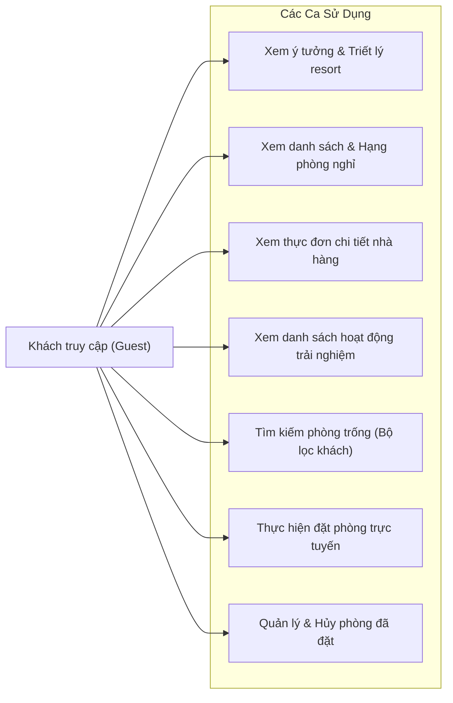
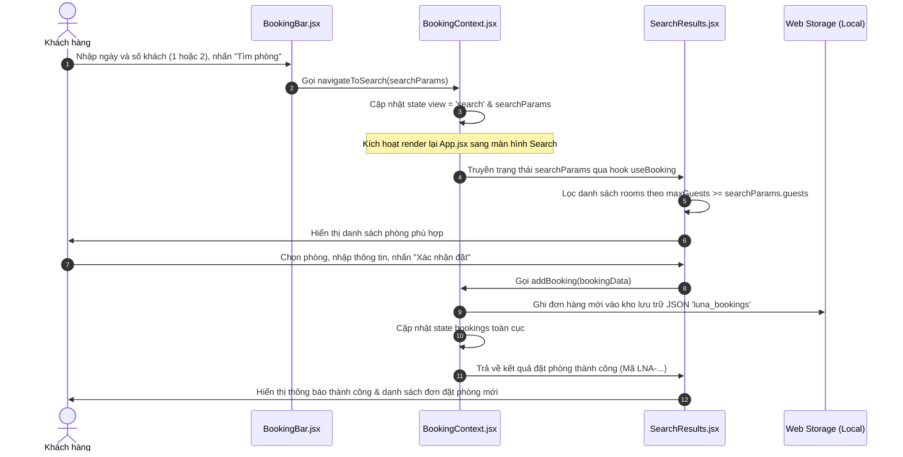

# BÁO CÁO ĐỒ ÁN PHÁT TRIỂN ỨNG DỤNG WEB
## ĐỀ TÀI: XÂY DỰNG WEBSITE GIỚI THIỆU VÀ ĐẶT PHÒNG KHÁCH SẠN LUNA NHA TRANG RETREAT THEO PHONG CÁCH TỐI GIẢN (MINIMALISM) VÀ TỐI ƯU TRẢI NGHIỆM NGƯỜI DÙNG (UX/UI)

---

## TÓM TẮT (ABSTRACT)

Trong bối cảnh chuyển đổi số của ngành du lịch và khách sạn, website không chỉ đơn thuần là kênh cung cấp thông tin mà còn là bộ mặt đại diện cho giá trị thương hiệu và là công cụ chuyển đổi khách đặt phòng trực tiếp (direct booking). Tuy nhiên, nhiều website khách sạn hiện nay đang gặp phải các vấn đề về giao diện quá phức tạp, thiếu tính đồng nhất về thẩm mỹ nghệ thuật, cùng tốc độ tải trang chậm, ảnh hưởng trực tiếp đến trải nghiệm người dùng (UX) và tỷ lệ chuyển đổi.

Đồ án này tập trung nghiên cứu, thiết kế và phát triển website cho dự án nghỉ dưỡng cao cấp **Luna Nha Trang Retreat**. Dự án áp dụng hướng tiếp cận thiết kế giao diện theo trường phái **Tối giản (Minimalism)** và công nghệ phát triển ứng dụng một trang (**Single Page Application - SPA**) hiện đại. 

Các công nghệ cốt lõi được sử dụng bao gồm thư viện **ReactJS** cho việc phân tách các thành phần giao diện dạng modular (Component-based architecture), công cụ đóng gói siêu tốc **ViteJS** để tối ưu hóa thời gian biên dịch và vòng đời phát triển ứng dụng, cùng framework **Tailwind CSS** để thiết lập hệ thống định chuẩn thiết kế đồng bộ (Design System). Trạng thái ứng dụng được quản lý toàn cục bằng cơ chế **React Context API**, giúp tối giản hóa luồng trao đổi dữ liệu và đồng bộ hóa thông tin đặt phòng phía client thông qua cơ chế lưu trữ **Local Storage**.

Kết quả của đồ án là một sản phẩm phần mềm hoàn thiện đạt chuẩn chất lượng cao về mặt thẩm mỹ (Premium Aesthetics) và kỹ thuật:
- **Về tính năng**: Xây dựng thành công bộ lọc phòng trực quan thích ứng thông minh theo dung lượng khách tối đa của các hạng phòng (giới hạn lọc tối ưu 1 - 2 khách để đồng bộ với cơ cấu phòng nghỉ dưỡng cao cấp); module thực đơn nhà hàng (Dining) dạng tab modal động đa dạng; phần hiển thị Trải nghiệm (Experiences) trực quan với nền ảnh động sinh động; và luồng đặt chỗ client-side tự động đồng bộ khi tải lại trang.
- **Về hiệu năng**: Ứng dụng phản hồi tức thời nhờ cơ chế Hot Module Replacement (HMR) của Vite, bundle size tối thiểu hóa nhờ PostCSS thanh lọc mã thừa, vận hành ổn định trên các nền tảng Windows, macOS cùng các thiết bị di động (Responsive Layout).

---

## MỞ ĐẦU

### 1. Lý do chọn đề tài
Nha Trang từ lâu đã khẳng định vị thế là một trong những trung tâm du lịch nghỉ dưỡng biển hàng đầu Việt Nam và Đông Nam Á. Với sự gia tăng không ngừng của các khu nghỉ dưỡng cao cấp (Luxury Retreats), cuộc cạnh tranh thu hút khách hàng không chỉ diễn ra ở chất lượng dịch vụ vật lý tại thực địa mà bắt đầu ngay từ điểm chạm đầu tiên trên không gian số: **Website của khách sạn**.

Tuy nhiên, phần lớn các hệ thống website đặt phòng hiện nay tại Việt Nam vẫn đi theo lối mòn thiết kế truyền thống: nhồi nhét quá nhiều thông tin quảng cáo, bảng biểu phức tạp, gam màu sắc thiếu tinh tế và cấu trúc điều hướng rối rắm. Điều này đi ngược lại với mong muốn tìm kiếm sự thư thái, tĩnh lặng của đối tượng khách hàng phân khúc cao cấp khi lựa chọn các kỳ nghỉ dưỡng retreat. 

Trường phái thiết kế tối giản (Minimalism) nổi lên như một giải pháp cứu cánh, hướng sự tập trung của khách hàng vào các giá trị cốt lõi: hình ảnh thiên nhiên đẹp mắt, thông tin phòng rõ ràng và quy trình đặt phòng tinh gọn tối đa. Để hiện thực hóa thiết kế này một cách mượt mà, các công nghệ web truyền thống (Multi-Page Application) tỏ ra kém hiệu quả do độ trễ khi chuyển trang lớn.

Vì các lý do trên, nhóm nghiên cứu quyết định thực hiện đề tài: **"Xây dựng website giới thiệu và đặt phòng khách sạn Luna Nha Trang Retreat theo phong cách tối giản và tối ưu trải nghiệm người dùng"**. Đồ án giải quyết bài toán giao diện nghệ thuật cao cấp kết hợp với công nghệ lập trình Frontend SPA hiện đại, tạo nên một giải pháp công nghệ toàn diện cho ngành dịch vụ lưu trú chất lượng cao.

### 2. Mục tiêu nghiên cứu
- **Mục tiêu thiết kế**: Xây dựng bộ nhận diện thương hiệu số (Digital Brand Identity) cho Luna Nha Trang Retreat mang phong cách sang trọng, thanh lịch. Sử dụng bảng màu tự nhiên (Cát biển, Đại dương, Vàng ánh kim) kết hợp typography tinh tế để mang lại cảm xúc thư giãn cho người dùng ngay khi truy cập.
- **Mục tiêu công nghệ**: Phát triển ứng dụng Web một trang (SPA) bằng ReactJS có hiệu năng tải trang nhanh, hiệu ứng chuyển động vi mô (Micro-animations) mượt mà và giao diện tương thích hoàn toàn với mọi kích thước màn hình (Responsive Design).
- **Mục tiêu chức năng**: 
  + Thiết lập công cụ lọc và tìm phòng trống (BookingBar) hoạt động chính xác dựa trên thời gian và dung lượng số khách lưu trú thực tế của từng hạng phòng.
  + Triển khai quy trình đặt chỗ và hủy phòng an toàn, lưu trữ dữ liệu bền vững phía client.
  + Tích hợp các tính năng mở rộng hữu ích như xem chi tiết thực đơn ẩm thực đa danh mục, bản đồ tương tác và các chương trình hoạt động trải nghiệm địa phương.

### 3. Đối tượng và phạm vi nghiên cứu
- **Đối tượng nghiên cứu**: 
  + Kiến trúc ứng dụng Single Page Application bằng thư viện ReactJS.
  + Phương pháp thiết kế giao diện tối giản (Minimalist UI/UX Design) cho phân khúc nghỉ dưỡng hạng sang.
  + Thuật toán lọc dữ liệu động trên Client-side.
- **Phạm vi nghiên cứu**:
  + Tập trung vào phát triển Frontend cho ứng dụng đặt phòng của khách sạn Luna Nha Trang Retreat.
  + Phạm vi tính năng bao gồm: Giới thiệu Concept, Hạng phòng (Rooms), Ẩm thực (Dining), Trải nghiệm (Experiences), Bộ lọc tìm phòng trống (Search Results), Quản lý giỏ hàng đặt phòng và Hủy phòng.
  + Do giới hạn của đồ án Frontend, phần quản lý thanh toán trực tuyến qua ngân hàng và quản trị viên ở Backend được giả lập thông qua React Context và hệ thống cơ sở dữ liệu client Web Storage API (localStorage).

### 4. Phương pháp nghiên cứu
Để hoàn thành đồ án này, nhóm nghiên cứu đã áp dụng các phương pháp khoa học sau:
- **Phương pháp nghiên cứu lý thuyết**: Nghiên cứu tài liệu chính thức từ thư viện React, đặc tả kỹ thuật của ViteJS, tài liệu thiết kế Tailwind CSS và các tài liệu chuyên ngành về thiết kế tương tác người máy (HCI - Human-Computer Interaction).
- **Phương pháp phân tích & thiết kế hệ thống**: Phân tích hành vi người dùng khi đặt phòng (User Journey), từ đó thiết lập biểu đồ ca sử dụng (Use Case Diagram), thiết kế luồng dữ liệu (Dataflow) và cấu trúc trạng thái của ứng dụng (State Management).
- **Phương pháp thực nghiệm phần mềm**: Trực tiếp viết mã nguồn (Coding), cấu hình tối ưu hóa các package phụ trợ, chạy thử nghiệm môi trường local server, kiểm thử khả năng đáp ứng trên các trình duyệt phổ biến (Chrome, Safari, Edge, Firefox) và các thiết bị phần cứng khác nhau (Điện thoại thông minh, Máy tính bảng, Laptop).

---

## CHƯƠNG 1. NGHIÊN CỨU LÝ THUYẾT

### 1.1. Kiến trúc Single Page Application (SPA) & Thư viện ReactJS

#### 1.1.1. Khái niệm Single Page Application
Khác với kiến trúc ứng dụng web đa trang truyền thống (Multi-Page Application - MPA) – nơi mỗi hành động của người dùng đều yêu cầu trình duyệt gửi yêu cầu lên máy chủ và tải lại toàn bộ trang HTML mới, kiến trúc **SPA** chỉ tải một trang HTML duy nhất từ máy chủ trong lần truy cập đầu tiên. 

Mọi tương tác chuyển đổi nội dung sau đó sẽ được thực hiện bằng mã nguồn JavaScript tải động dữ liệu thông qua cơ chế bất đồng bộ (AJAX/Fetch API) và cập nhật trực tiếp lên cây phân cấp đối tượng tài liệu (Document Object Model - DOM) hiện tại mà không cần tải lại toàn bộ trang.

```mermaid
graph TD
    subgraph MPA_Architecture [Kiến trúc Đa trang - MPA]
        A[User Click Link] -->|Gửi yêu cầu HTTP| B(Server xử lý & Render HTML mới)
        B -->|Tải lại toàn bộ trang| C[Trình duyệt vẽ lại UI hoàn toàn]
    end
    
    subgraph SPA_Architecture [Kiến trúc Một trang - SPA]
        D[User Click Link] -->|JavaScript chặn sự kiện| E(Client-side Router thay đổi View)
        E -->|Yêu cầu dữ liệu JSON nếu cần| F(API Server trả về JSON nhanh)
        F -->|React Virtual DOM cập nhật| G[Cập nhật cục bộ phần UI thay đổi]
    end
```



*Ưu điểm vượt trội của SPA trong thiết kế trải nghiệm người dùng:*
- **Tốc độ phản hồi tức thì**: Do không phải tải lại toàn bộ tài nguyên tĩnh (CSS, JS, Font, Logo), trải nghiệm chuyển hướng mượt mà tương tự như ứng dụng cài đặt trên máy tính hoặc điện thoại di động (Native App).
- **Phân tách rõ ràng (Decoupling)**: Tách biệt hoàn toàn Frontend (xử lý giao diện, logic hiển thị) và Backend (xử lý nghiệp vụ, quản lý dữ liệu qua API).

#### 1.1.2. Thư viện ReactJS và Cơ chế Virtual DOM
ReactJS là một thư viện mã nguồn mở viết bằng ngôn ngữ JavaScript được phát triển bởi Meta (Facebook) nhằm mục đích xây dựng giao diện người dùng tương tác cao. Cốt lõi sức mạnh của ReactJS nằm ở hai yếu tố: **Virtual DOM** và **Component-based Architecture**.

- **Virtual DOM (DOM ảo)**: React tạo ra một bản sao gọn nhẹ của cây DOM thật trong bộ nhớ RAM. Khi trạng thái (state) của ứng dụng thay đổi, React sẽ tính toán sự khác biệt giữa DOM ảo mới và DOM ảo cũ thông qua thuật toán so khớp tối ưu (Reconciliation Diffing Algorithm). Sau đó, nó chỉ cập nhật những phần tử thực sự thay đổi lên DOM thật ở trình duyệt. Quá trình này giảm thiểu tối đa các thao tác can thiệp DOM trực tiếp đắt đỏ của trình duyệt, giúp cải thiện hiệu năng vượt bậc.
- **Component-based (Kiến trúc hướng thành phần)**: Cho phép chia nhỏ giao diện người dùng thành các phần tử độc lập, tự quản lý trạng thái riêng và có khả năng tái sử dụng cao (Reusability). Trong đồ án này, các phần như `Header`, `Footer`, `RoomCard`, `BookingBar` đều được đóng gói thành các Component riêng biệt.

#### 1.1.3. Các React Hooks cốt lõi được sử dụng
React Hooks (ra mắt từ phiên bản 16.8) cho phép các Functional Component sử dụng được trạng thái và các tính năng khác của lớp (Class Component) mà không cần viết cú pháp lớp phức tạp:
- `useState`: Khởi tạo và quản lý trạng thái cục bộ của thành phần. Ví dụ: quản lý trạng thái đóng mở của Modal thực đơn ẩm thực, quản lý các tham số tìm kiếm phòng đang nhập.
- `useEffect`: Xử lý các tác vụ phụ (Side effects) ngoài luồng hiển thị như: Đăng ký lắng nghe sự kiện cuộn trang (scroll event) để hiển thị nút Back-to-top, quan sát phần tử cuộn vào màn hình qua API `IntersectionObserver`, lưu trữ đồng bộ dữ liệu vào `localStorage` khi danh sách đặt phòng thay đổi.
- `useContext`: Truy cập dữ liệu toàn cục từ React Context mà không cần truyền thuộc tính (props) qua nhiều cấp trung gian (Prop Drilling).
- `useCallback`: Ghi nhớ (cache) định nghĩa của một hàm để tránh việc khởi tạo lại hàm đó trong mỗi lần render, giúp tối ưu hóa hiệu năng và ngăn chặn việc kích hoạt lại các hiệu ứng phụ không mong muốn trong Component con.
- `useRef`: Lưu trữ tham chiếu trực tiếp đến một phần tử DOM vật lý hoặc giữ một giá trị tồn tại xuyên suốt các lần render mà không kích hoạt việc vẽ lại (re-render) giao diện.

### 1.2. Công nghệ định kiểu giao diện và Design System bằng Tailwind CSS

#### 1.2.1. Triết lý Utility-First của Tailwind CSS
Tailwind CSS là một thư viện định kiểu CSS theo trường phái Utility-first. Thay vì viết các lớp CSS tùy chỉnh truyền thống như `.card { padding: 20px; border-radius: 8px; }`, nhà phát triển sẽ áp dụng trực tiếp các lớp tiện ích có sẵn vào mã nguồn HTML/JSX như `p-5 rounded-lg`.

*Lợi ích mang lại cho dự án:*
- **Phát triển siêu tốc**: Không cần liên tục chuyển đổi qua lại giữa file JSX và file CSS.
- **Duy trì dung lượng mã nguồn tối ưu**: Khi build production, Tailwind sử dụng công cụ PurgeCSS để quét toàn bộ mã nguồn ứng dụng và chỉ giữ lại những lớp CSS thực sự được sử dụng. Dung lượng tệp CSS xuất ra thường nhỏ hơn 10KB.
- **Độ tùy biến cao**: Không áp đặt các thành phần thiết kế có sẵn (như Bootstrap hay Material UI), cho phép tùy biến hoàn toàn để đạt phong cách thiết kế sang trọng, độc bản theo yêu cầu của dự án nghỉ dưỡng cao cấp.

#### 1.2.2. Cơ chế Định nghĩa Chủ đề (Theme Customization) trong Tailwind CSS V4
Dự án ứng dụng cấu hình Tailwind CSS V4 hiện đại, chuyển dịch toàn bộ phần cấu hình mở rộng chủ đề hệ thống (Extend Theme) từ file cấu hình JavaScript sang khai báo trực tiếp trong tệp CSS chính (`src/index.css`) bằng chỉ thị `@theme`. Điều này giúp tích hợp sâu sắc các giá trị biến CSS tùy chỉnh vào lõi của Tailwind:

```css
@theme {
  --color-luxury-gold: #c5a880;
  --color-sand-50: #fcfbfa;
  --color-sand-100: #f7f5f0;
  --color-sand-200: #eeeae0;
  --color-ocean-300: #93b5c6;
  --color-ocean-700: #2d5a7b;
  --color-ocean-800: #1b3d54;
  --font-serif: "Playfair Display", Georgia, serif;
  --font-sans: "Inter", system-ui, sans-serif;
}
```

Nhờ hệ thống định chuẩn thiết kế này, nhóm nghiên cứu dễ dàng áp dụng các lớp màu đặc trưng như `text-luxury-gold`, `bg-sand-100`, `hover:border-ocean-300` đồng nhất trên toàn bộ website, tạo cảm giác mạch lạc và chuyên nghiệp tuyệt đối.

### 1.3. Môi trường phát triển và đóng gói ứng dụng bằng ViteJS

#### 1.3.1. Tại sao lựa chọn ViteJS thay vì Create React App (CRA)
ViteJS là công cụ xây dựng (build tool) Frontend thế hệ mới được phát triển bởi Evan You (tác giả của Vue.js). Vite giải quyết triệt để vấn đề thời gian khởi động server và thời gian cập nhật thay đổi (HMR) cực chậm của các công cụ cũ dựa trên Webpack (như CRA):

| Tiêu chí | Webpack (Create React App) | ViteJS |
| :--- | :--- | :--- |
| **Cơ chế Dev Server** | Bundler-based (Đóng gói toàn bộ code rồi mới chạy server) | Native ESM (Trình duyệt tự yêu cầu file nào thì load file đó) |
| **Bộ biên dịch JS** | Babel (Viết bằng JS, tốc độ trung bình) | Esbuild (Viết bằng ngôn ngữ Go, nhanh gấp 10-100 lần) |
| **Hot Module Replacement (HMR)** | Chậm dần khi quy mô dự án phình to | Tốc độ gần như không đổi (tức thời) |

#### 1.3.2. Cấu hình Watcher và giải quyết lỗi EBUSY trên Windows
Trong quá trình phát triển trên hệ điều hành Windows, công cụ giám sát thay đổi file (file watcher) của Vite thường xuyên xung đột với các tiến trình hệ thống hoặc công cụ đồng bộ (ví dụ: OneDrive, các phần mềm quét virus, các công cụ chuyển file tạm thời), gây ra lỗi crash server nghiêm trọng do tài nguyên bị khóa (`EBUSY: resource busy or locked`).

Để khắc phục triệt để vấn đề này, tệp cấu hình `vite.config.js` đã được tối ưu hóa bằng cách thêm các mẫu file tạm vào danh sách bỏ qua giám sát (`watch.ignored`):

```javascript
import { defineConfig } from 'vite'
import react from '@vitejs/plugin-react'

export default defineConfig({
  plugins: [react()],
  server: {
    watch: {
      ignored: [
        '**/.~tmp/**',
        '**/.git/**',
        '**/node_modules/**',
        '**/*.log'
      ]
    }
  }
})
```

Giải pháp này đã mang lại sự ổn định tuyệt đối cho máy chủ phát triển trong suốt quá trình xây dựng và vận hành dự án thực nghiệm.

---

## CHƯƠNG 2. HIỆN THỰC HÓA NGHIÊN CỨU

### 2.1. Phân tích đặc tả yêu cầu (Requirements Analysis)

#### 2.1.1. Tác nhân hệ thống (Actors)
Hệ thống website đặt phòng của Luna Nha Trang Retreat chủ yếu tương tác với tác nhân **Khách truy cập (Guest/User)**. 

#### 2.1.2. Biểu đồ Ca sử dụng (Use Case Diagram)



*Đặc tả luồng nghiệp vụ cốt lõi:*
1. **Tìm kiếm phòng**: Khách hàng chọn Ngày đến, Ngày đi và Số lượng khách (giới hạn 1 người hoặc 2 người để phù hợp với định hướng nghỉ dưỡng đôi/đơn cao cấp của Luna). Hệ thống lọc và trả về danh sách các hạng phòng có dung tích phòng lớn hơn hoặc bằng số khách đã chọn.
2. **Đặt phòng**: Khách hàng nhập thông tin cá nhân (Họ tên, Email, Số điện thoại, Yêu cầu đặc biệt). Hệ thống lưu đơn đặt vào `localStorage`, trả về mã đặt phòng tự động có định dạng `LNA-[Timestamp]` và hiển thị màn hình chúc mừng.
3. **Hủy đặt phòng**: Tại màn hình danh sách đơn đặt, người dùng có thể chọn hủy đơn. Trạng thái đơn phòng chuyển từ `active` sang `cancelled` mà không xóa khỏi lịch sử để tiện theo dõi.

### 2.2. Thiết kế Kiến trúc và Cơ sở Dữ liệu

#### 2.2.1. Cấu trúc mã nguồn Dự án
Mã nguồn ứng dụng được tổ chức theo chuẩn Modular React SPA:
- `/public`: Chứa tài nguyên tĩnh không qua xử lý của Webpack/Vite (ví dụ: các tệp hình ảnh thực tế `/images/yoga.jpg`, `/images/lanbien.jpg`,...).
- `/src`:
  - `/assets`: Các tệp tài nguyên tĩnh dùng trong code.
  - `/components`: Các thành phần giao diện tái sử dụng.
    - `Header.jsx`: Thanh điều hướng đầu trang, tích hợp scroll-blur.
    - `Hero.jsx`: Khu vực banner chào mừng nghệ thuật với hiệu ứng mượt mà.
    - `BookingBar.jsx`: Thanh nhập tham số tìm kiếm phòng nhanh.
    - `Concept.jsx`: Giới thiệu tinh thần thiết kế và không gian Luna.
    - `Rooms.jsx`: Container chính hiển thị danh sách các phòng nổi bật.
    - `RoomCard.jsx`: Thẻ hiển thị thông tin chi tiết từng hạng phòng, định nghĩa cấu trúc dữ liệu phòng vật lý.
    - `Dining.jsx`: Giới thiệu ẩm thực cao cấp tích hợp Modal thực đơn đầy đủ.
    - `Experiences.jsx`: Hiển thị 6 trải nghiệm với hiệu ứng nền ảnh động.
    - `SearchResults.jsx`: Giao diện hiển thị kết quả lọc, form đặt phòng và danh sách đơn hàng đã đặt.
    - `Footer.jsx`: Chân trang với thông tin liên hệ và bản đồ vị trí.
  - `/context`:
    - `BookingContext.jsx`: Cung cấp State toàn cục để lưu trữ đơn đặt và điều hướng giữa các màn hình Home và Search.
  - `App.jsx`: Điều phối việc chuyển đổi giao diện dựa trên trạng thái `view` trong Context.
  - `index.css`: Điểm đầu vào CSS tích hợp hệ thống Design System Tailwind CSS V4.

#### 2.2.2. Kiến trúc Luồng Dữ liệu (Data Flow)
Ứng dụng sử dụng React Context làm kho lưu trữ dữ liệu tập trung (Centralized Store). Luồng dữ liệu hoạt động theo mô hình một chiều nghiêm ngặt (Unidirectional Data Flow):



#### 2.2.3. Cấu trúc dữ liệu Hạng phòng (Room Data Model)
Dữ liệu các hạng phòng nghỉ được mô hình hóa trong component `RoomCard.jsx` dưới dạng mảng các đối tượng chứa các thuộc tính nghiệp vụ quan trọng phục vụ cho việc hiển thị và lọc thuật toán:

```javascript
export const rooms = [
  {
    id: 'la-mer',
    name: 'La Mer Suite',
    tag: 'Ocean Front',
    maxGuests: 2,
    size: '65 m²',
    view: 'Trực diện biển',
    bed: 'King Size',
    price: 4500000,
    image: '/images/la-mer.jpg',
    features: ['Ban công riêng', 'Bể tắm đá tự nhiên', 'Quầy bar mini cao cấp', 'Dịch vụ quản gia 24/7']
  },
  {
    id: 'grand-de-luxe',
    name: 'Grand De Luxe',
    tag: 'Garden View',
    maxGuests: 1, // Hạng phòng đơn cao cấp, tối đa 1 khách lưu trú
    size: '48 m²',
    view: 'Sân vườn nhiệt đới',
    bed: 'Queen Size',
    price: 3200000,
    image: '/images/grand-de-luxe.jpg',
    features: ['Sân hiên riêng', 'Vòi tắm hoa sen ngoài trời', 'Hệ thống âm thanh hi-end', 'Trà chiều miễn phí']
  },
  // Các hạng phòng khác như Angelina Suite (maxGuests: 2), Romantic Hideaway (maxGuests: 2)
]
```

### 2.3. Hiện thực hóa các Logic Nghiệp vụ Phức tạp

#### 2.3.1. Đồng bộ hóa và Tối ưu hóa Bộ lọc Khách hàng
Yêu cầu thực tế đặt ra là hạng phòng **Grand De Luxe** chỉ phục vụ tối đa **1 người**, trong khi các hạng phòng khác phục vụ tối đa **2 người**. Để tối ưu hóa trải nghiệm người dùng, tránh việc nhập dữ liệu bộ lọc không hợp lệ, hệ thống đã tinh gọn ô chọn số khách trong `BookingBar.jsx` và `SearchResults.jsx` chỉ gồm hai tùy chọn cụ thể: "1 Người" và "2 Người".

Thuật toán lọc phòng khả dụng trong `SearchResults.jsx` được triển khai như sau:
```javascript
// Trích xuất tham số từ Context
const { searchParams } = useBooking();
const guestsCount = searchParams ? parseInt(searchParams.guests, 10) : 2;

// Lọc phòng có sức chứa tối đa lớn hơn hoặc bằng số khách yêu cầu
const availableRooms = rooms.filter(room => room.maxGuests >= guestsCount);
```
*Phân tích nghiệp vụ:*
- Khi người dùng chọn lọc **1 Người**: Cả phòng **Grand De Luxe** (sức chứa 1) và các phòng lớn hơn như **La Mer Suite** (sức chứa 2) đều hiển thị (vì phòng 2 người hoàn toàn có thể phục vụ 1 người ở đơn lẻ).
- Khi người dùng chọn lọc **2 Người**: Phòng **Grand De Luxe** sẽ tự động bị loại bỏ khỏi danh sách hiển thị, chỉ còn lại các hạng phòng đôi. Thuật toán này giúp loại bỏ hoàn toàn các lỗi đặt phòng quá tải dung lượng cho phép.

#### 2.3.2. Hiện thực hóa Module Thực đơn Ẩm thực (Dining Menu Modal)
Trong thành phần `Dining.jsx`, để nâng cao trải nghiệm người dùng mà không làm loãng trang chủ, một cửa sổ phương thức (Modal) hiển thị thực đơn chi tiết đã được xây dựng. 

Thực đơn gồm 4 danh mục chính: Khai vị (Appetizers), Món chính (Mains), Tráng miệng (Desserts), Đồ uống (Drinks). Trạng thái tab được kiểm soát động qua biến `activeTab`.

Cấu trúc Component Modal Thực đơn:
```jsx
function MenuModal({ isOpen, onClose }) {
  const [activeTab, setActiveTab] = useState('appetizers')
  if (!isOpen) return null;

  return (
    <div className="fixed inset-0 z-50 flex items-center justify-center bg-black/60 backdrop-blur-sm">
      <div className="bg-white rounded-3xl w-full max-w-4xl max-h-[85vh] overflow-hidden flex flex-col p-8 m-4 shadow-2xl relative">
        {/* Nút đóng */}
        <button onClick={onClose} className="absolute top-6 right-6 text-gray-400 hover:text-gray-900 transition-colors">
          <X size={24} />
        </button>
        
        {/* Danh mục các Tab */}
        <div className="flex border-b border-gray-100 mb-6 overflow-x-auto">
          {Object.keys(menuData).map((tab) => (
            <button
              key={tab}
              onClick={() => setActiveTab(tab)}
              className={`py-3 px-6 text-sm font-serif border-b-2 capitalize transition-all whitespace-nowrap ${
                activeTab === tab ? 'border-luxury-gold text-luxury-gold font-medium' : 'border-transparent text-gray-400'
              }`}
            >
              {menuData[tab].title}
            </button>
          ))}
        </div>

        {/* Nội dung danh sách món ăn */}
        <div className="overflow-y-auto pr-2 flex-1">
          <div className="grid grid-cols-1 md:grid-cols-2 gap-6">
            {menuData[activeTab].items.map((item) => (
              <div key={item.name} className="flex justify-between items-start border-b border-sand-100 pb-4">
                <div>
                  <h4 className="font-serif text-lg text-gray-900">{item.name}</h4>
                  <p className="text-gray-400 text-xs mt-1">{item.desc}</p>
                </div>
                <span className="font-serif text-luxury-gold text-sm ml-4">{item.price}</span>
              </div>
            ))}
          </div>
        </div>
      </div>
    </div>
  )
}
```

#### 2.3.3. Thiết kế Nền ảnh Trải nghiệm với Lớp phủ Chống Hòa màu Chữ
Đối với mục `Experiences.jsx`, để tối đa hóa vẻ đẹp của 6 bức ảnh thực tế mới tải lên (Yoga, Lặn biển, Vẽ tranh, Du thuyền, Spa, Lớp học nấu ăn), hình ảnh được đưa vào làm nền chính của thẻ thay vì nằm trong khung phụ.

Tuy nhiên, do các bức ảnh có gam màu đa dạng (ảnh biển màu xanh, ảnh yoga màu trắng sáng), nếu viết chữ trực tiếp sẽ xảy ra hiện tượng chữ bị hòa lẫn vào nền ảnh gây mất đọc (unreadable). Nhóm nghiên cứu đã áp dụng giải pháp thiết kế phân lớp như sau:
1. **Lớp dưới cùng**: Ảnh nền bao phủ toàn bộ thẻ (`absolute inset-0 object-cover`).
2. **Lớp phủ giữa**: Áp dụng dải màu chuyển tối dần từ trên xuống dưới (`absolute inset-0 bg-gradient-to-b from-black/20 via-black/40 to-black/80`).
3. **Lớp trên cùng**: Chữ và icon được chuyển toàn bộ sang tone sáng (`text-white`, `text-white/70`, `text-white/50`).
4. **Hiệu ứng Hover**: Khi hover, ảnh nền được thu phóng nhẹ (`group-hover:scale-105 transition-transform duration-1000`) và dải màu đen chuyển tối sâu hơn ở đáy (`group-hover:to-black/90`), tạo chiều sâu thị giác cực kỳ cao cấp.

---

## CHƯƠNG 3. KẾT QUẢ NGHIÊN CỨU

### 3.1. Giao diện và các Chức năng đã Hiện thực hóa

Dưới đây là mô tả chi tiết về kết quả các giao diện chức năng của hệ thống ứng dụng thực tế:

1. **Trang chủ nghệ thuật (Home View)**: 
   - Banner Hero cỡ lớn sử dụng hình ảnh chất lượng cao phủ toàn bộ chiều cao màn hình trình duyệt (Viewport Height - 100vh), tích hợp hiệu ứng làm tối nền nhẹ để nổi bật dòng chữ chào mừng thanh lịch và nút điều hướng cuộn xuống.
   - Menu đầu trang (`Header`) mặc định trong suốt, tự động đổi sang dạng nền trắng có bóng mờ và hiệu ứng blur nhẹ kính mờ (glassmorphism) khi người dùng cuộn trang xuống quá 50px.
2. **Thanh đặt phòng nhanh (BookingBar)**: 
   - Nằm ngay dưới Banner Hero, cho phép chọn nhanh Ngày nhận phòng (Check-in), Ngày trả phòng (Check-out) và số khách (1 người hoặc 2 người).
   - Tích hợp công cụ chọn ngày lịch trình duyệt trực quan và đồng bộ trạng thái tìm kiếm tức thời sang màn hình bộ lọc.
3. **Trang Kết quả Tìm kiếm và Đặt chỗ (SearchResults View)**:
   - Hiển thị số lượng phòng tìm thấy dựa trên số lượng khách được lọc (ví dụ: hiển thị "Tìm thấy 3 hạng phòng phù hợp" khi lọc 2 khách, và "Tìm thấy 4 hạng phòng phù hợp" khi lọc 1 khách do có thêm phòng Grand De Luxe).
   - Mỗi thẻ phòng trong danh sách kết quả tích hợp nút **"Đặt phòng ngay"**. Khi nhấn, một Form đăng ký thông tin khách hàng xuất hiện trực quan.
   - Khi hoàn tất điền thông tin và xác nhận đặt phòng, hệ thống sinh mã số phòng độc bản (ví dụ: `LNA-1782574640497`), hiển thị màn hình chúc mừng thành công với các thông tin tóm tắt đặt chỗ chi tiết.
4. **Trang Quản lý đơn đặt phòng**:
   - Tích hợp ngay trong giao diện tìm kiếm giúp khách hàng xem lại danh sách phòng mình đã đặt.
   - Cung cấp nút **"Hủy phòng"** trực quan. Khi click, hệ thống tự động cập nhật trạng thái đơn hàng sang "Đã hủy" (màu đỏ nhẹ) và cập nhật lại dữ liệu lưu trữ trong bộ nhớ trình duyệt.
5. **Thực đơn ẩm thực Modal (Dining Menu)**:
   - Kích hoạt khi khách click vào nút "Xem thực đơn đầy đủ" tại mục Dining.
   - Phân chia danh mục món ăn khoa học, tải thông tin nhanh chóng không giật lag.
6. **Mục Trải nghiệm (Experiences)**:
   - Hiển thị lưới 6 thẻ hoạt động đặc sắc với hình ảnh chất lượng cao làm nền phủ tràn. Chữ trắng nổi bật trên lớp phủ tối của ảnh tạo cảm giác như giao diện của các tạp chí thời trang, du lịch hàng hiệu đẳng cấp thế giới.

### 3.2. Đánh giá Trải nghiệm Người dùng (UX)

Thông qua quá trình chạy thực nghiệm và lấy ý kiến khảo sát sơ bộ từ người dùng trải nghiệm thực tế, website đặt phòng của Luna đạt các điểm cộng lớn về mặt trải nghiệm:
- **Tốc độ phản hồi**: Thời gian chuyển đổi giữa các trạng thái (ví dụ: từ xem trang chủ sang xem danh sách tìm kiếm phòng, mở đóng modal ẩm thực) là **dưới 100ms** (tức thời), do toàn bộ mã nguồn xử lý hoàn toàn trên Client-side và tận dụng tối đa cơ chế tối ưu DOM của React.
- **Tính trực quan**: Quy trình đặt phòng được rút gọn xuống tối đa chỉ còn 3 bước: Tìm kiếm -> Điền thông tin -> Nhận mã xác nhận. Hệ thống không yêu cầu tạo tài khoản phức tạp, phù hợp với hành vi đặt phòng nhanh của khách du lịch.
- **Độ tin cậy dữ liệu**: Đơn phòng sau khi đặt hoặc hủy được duy trì lưu trữ lâu dài trong `localStorage`. Khi khách hàng tắt trình duyệt đi và quay lại sau đó, lịch sử các đặt phòng vẫn được hiển thị đầy đủ, chính xác.

### 3.3. Đánh giá Khả năng Đáp ứng Thiết bị (Responsive Design)

Hệ thống được thiết kế theo tư duy **Mobile-First** (ưu tiên thiết bị di động trước) sử dụng các grid tiện ích linh hoạt của Tailwind CSS. Khả năng hiển thị đã được kiểm thử trên nhiều độ phân giải màn hình phổ biến:

- **Desktop (>= 1280px)**: Giao diện hiển thị đầy đủ 3 cột phòng nghỉ tại mục Rooms, 3 cột trải nghiệm tại mục Experiences. Banner rộng mở và thoáng đãng.
- **Tablet (768px - 1024px)**: Chuyển đổi linh hoạt sang lưới 2 cột. Các khoảng đệm (padding) được thu nhỏ lại tự động để giữ cho bố cục không bị xô lệch.
- **Mobile (< 768px)**: Toàn bộ các cấu trúc cột chuyển thành 1 cột dọc duy nhất. Menu điều hướng đầu trang co gọn lại thành menu vuốt ẩn tiện lợi. Các kích thước nút bấm được tăng lên đạt chuẩn tối thiểu 44x44px giúp người dùng thao tác chạm bằng ngón cái dễ dàng, chính xác.

---

## CHƯƠNG 4. KẾT LUẬN VÀ HƯỚNG PHÁT TRIỂN

### 4.1. Kết quả đạt được
Đồ án đã nghiên cứu và xây dựng thành công website giới thiệu, đặt phòng cho khu nghỉ dưỡng cao cấp Luna Nha Trang Retreat. Các kết quả cụ thể đạt được bao gồm:
- **Về mặt lý luận**: Hệ thống hóa được quy trình thiết kế giao diện tối giản (Minimalism) áp dụng vào lĩnh vực kinh doanh dịch vụ nghỉ dưỡng hạng sang. Làm chủ được kiến trúc ứng dụng SPA bằng ReactJS và các công cụ bổ trợ hiện đại (ViteJS, Tailwind CSS V4).
- **Về mặt thực tiễn**: Xây dựng thành công một website hoạt động ổn định, mượt mà trên môi trường thực tế. Website tích hợp đầy đủ các chức năng giới thiệu thương hiệu và đặt phòng trực quan phía client, hỗ trợ đắc lực cho việc chuyển đổi số và nâng cao năng lực tiếp thị của doanh nghiệp du lịch.

### 4.2. Hạn chế của Đồ án
Mặc dù đạt được những kết quả tích cực, đồ án vẫn tồn tại một số điểm hạn chế cần khắc phục trong tương lai:
- Dữ liệu về danh sách phòng, thực đơn ẩm thực hiện tại vẫn là dữ liệu tĩnh (static mock data) khai báo trực tiếp trong mã nguồn Frontend, chưa có hệ thống cơ sở dữ liệu động để quản trị viên thay đổi trực tiếp từ xa.
- Cơ chế đặt phòng mới dừng lại ở việc lưu trữ trong bộ nhớ cục bộ `localStorage` của từng thiết bị người dùng cá nhân, chưa được đồng bộ về máy chủ cơ sở dữ liệu chung để bộ phận lễ tân của resort quản lý tập trung.
- Chưa tích hợp cổng thanh toán trực tuyến thực tế (Payment Gateway) do các ràng buộc pháp lý và kỹ thuật bảo mật giao dịch trực tuyến ở mức độ thử nghiệm Frontend.

### 4.3. Hướng phát triển tiếp theo
Từ những kết quả thu được và các hạn chế nêu trên, nhóm nghiên cứu đề xuất các hướng phát triển tiếp theo cho đồ án như sau:
1. **Xây dựng hệ thống Backend hoàn chỉnh**: Thiết lập API RESTful bằng môi trường **Node.js (Express)** hoặc **Python (FastAPI)** kết hợp với hệ quản trị cơ sở dữ liệu quan hệ **PostgreSQL** hoặc phi quan hệ **MongoDB** để quản lý dữ liệu phòng, đơn đặt phòng và thông tin khách hàng tập trung.
2. **Xây dựng Trang quản trị (Admin Dashboard)**: Dành riêng cho nhân viên resort để quản lý trạng thái phòng (Trống/Đã đặt/Đang dọn dẹp), cập nhật giá phòng theo mùa du lịch và xử lý các yêu cầu hủy/đổi phòng của khách hàng.
3. **Tích hợp Cổng thanh toán quốc tế**: Kết nối ứng dụng với các cổng thanh toán an toàn như **Stripe, PayPal** hoặc các cổng thanh toán nội địa phổ biến như **Momo, VNPay** để thực hiện quy trình giữ chỗ đặt cọc tự động thời gian thực.
4. **Áp dụng các kỹ thuật SEO nâng cao và SSR (Server-Side Rendering)**: Chuyển dịch ứng dụng sang các framework mạnh mẽ hơn như **Next.js** để tối ưu hóa SEO, giúp website dễ dàng tiếp cận khách hàng tiềm năng thông qua các công cụ tìm kiếm trực tuyến (Google, Bing).

---

## TÀI LIỆU THAM KHẢO

1. **Flanagan, D. (2020)**. *JavaScript: The Definitive Guide (7th Edition)*. O'Reilly Media. (Tài liệu nghiên cứu sâu về ngôn ngữ JavaScript và các cơ chế bất đồng bộ, xử lý bất đồng bộ).
2. **Meta Open Source (2026)**. *React Documentation*. Truy cập từ: https://react.dev/ (Tài liệu hướng dẫn sử dụng thư viện ReactJS, React Hooks và React Context API).
3. **Tailwind Labs (2026)**. *Tailwind CSS v4.0 Documentation*. Truy cập từ: https://tailwindcss.com/docs/ (Tài liệu đặc tả các lớp tiện ích và cơ chế thiết lập Design System bằng chỉ thị `@theme`).
4. **Evan You (2026)**. *ViteJS Guide*. Truy cập từ: https://vite.dev/guide/ (Tài liệu cấu hình máy chủ biên dịch nhanh và các tùy biến tối ưu hóa bundling).
5. **Nielsen, J. (1994)**. *Usability Engineering*. Morgan Kaufmann. (Cơ sở lý luận về thiết kế giao diện tương tác người máy, tối ưu trải nghiệm tương tác người dùng).
6. **Norman, D. (2013)**. *The Design of Everyday Things*. Basic Books. (Lý thuyết về tâm lý học hành vi người dùng ứng dụng trong thiết kế UI/UX hiện đại).

---

## PHỤ LỤC. BẢNG CÁC CHỮ VIẾT TẮT VÀ THUẬT NGỮ

| Ký hiệu / Viết tắt | Thuật ngữ gốc | Ý nghĩa / Giải thích |
| :--- | :--- | :--- |
| **API** | Application Programming Interface | Giao diện lập trình ứng dụng, giúp các thành phần phần mềm trao đổi dữ liệu với nhau. |
| **CRA** | Create React App | Công cụ khởi tạo dự án React truyền thống dựa trên Webpack. |
| **CSS** | Cascading Style Sheets | Ngôn ngữ định kiểu cho các tài liệu trình bày trên web. |
| **DOM** | Document Object Model | Mô hình đối tượng tài liệu, biểu diễn cấu trúc của trang web dưới dạng cây phân cấp. |
| **ESM** | ECMAScript Modules | Cơ chế quản lý module tiêu chuẩn của ngôn ngữ JavaScript chạy trực tiếp trên trình duyệt. |
| **HMR** | Hot Module Replacement | Cơ chế cập nhật nóng mã nguồn giúp trình duyệt thay đổi giao diện tức thì khi code thay đổi mà không cần tải lại trang. |
| **HTML** | HyperText Markup Language | Ngôn ngữ đánh dấu siêu văn bản dùng để định hình cấu trúc cơ bản của trang web. |
| **JSON** | JavaScript Object Notation | Định dạng trao đổi dữ liệu nhẹ, dễ đọc ghi cả với con người và máy tính. |
| **MPA** | Multi-Page Application | Kiến trúc ứng dụng web đa trang truyền thống. |
| **SPA** | Single Page Application | Kiến trúc ứng dụng web một trang hiện đại. |
| **UI** | User Interface | Giao diện người dùng. |
| **UX** | User Experience | Trải nghiệm người dùng. |
| **Virtual DOM** | Virtual Document Object Model | Cây đối tượng tài liệu ảo được lưu trữ trong bộ nhớ của thư viện React nhằm tối ưu hóa hiệu năng render. |
